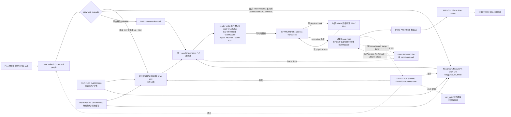

# STM32U5A9J-DK 高性能 LVGL 9.x 图形底层平台技术计划

> 状态：执行 v0.7；M0 已于 2026-08-23 完成并通过（含追加的 LVGL 集成与 FreeRTOS OS 层启用），M1 尚未开始。M0 证据见 [01_bringup_log.md](01_bringup_log.md)。  
> 日期：2026-08-23。  
> 本文定义底层渲染平台、可观测性和合成基准；不包含业务 UI、仪表外观或通信协议栈。M0 已建立无显示的构建/RTOS/硬件基线，未把 Riverdi 的 LCD 参数移植到目标板。

## 1. 资料基线与当前结论

### 1.1 已核对资料

| 资料 | 本计划采用的结论 |
|---|---|
| [RM0456 Rev.7](../STM32U5%20series%20Arm_Sup_%C2%AE__Sup_-based%2032-bit%20MCUs%20-%20Reference%20manual.pdf)，重点为 §2.1、§6.3.1、§9.3、§15.2.5、§21.4 | SRAM 精确容量/地址、零等待访问范围、主从总线可达性、32-byte DCACHE line、GPU2D DCACHE2 一致性要求、GFXMMU 虚拟行宽和 Cache 限制 |
| [UM2967 Rev.5](../Discovery%20kits%20with%20STM32U5x9NJ%20MCUs%20-%20User%20manual.pdf)，重点为 §7.6、§8.1、§8.3/8.4 | 板卡 DSI、HSE、外部存储和板卡版本事实 |
| `stm32u5x9j-dk-bsp/stm32u5x9j_discovery_lcd.c/.h` | `BSP_LCD_Init()` 内的 GFXMMU → DSI → LTDC → DSI start → 面板初始化顺序；480×480、DSI 2-lane video mode、LTDC/DSI 参数；ARGB8888 圆屏 LUT 与物理缓冲大小 |
| `stm32u5x9j-dk-bsp/stm32u5x9j_discovery_gfxmmu_lut.h` | 现有 LUT 只对应 ARGB8888；不能直接当作 RGB565 LUT 使用 |
| `stm32u5x9j-dk-bsp/stm32u5x9j_discovery_hspi.c/.h`、`..._ospi.c/.h`、`..._ts.c/.h` | 目标 BSP 实际提供 APS512XX HSPI PSRAM、MX25UM51245G OSPI NOR、Sitronix 触摸 API |
| `STM32CubeU5/Projects/STM32U5x9J-DK/Examples/DSI/DSI_VideoMode_SingleBuffer/` | 已验证 DSI video mode 的时钟树、管脚和启动顺序；当前 `main.c/.ioc` 实际未初始化 GFXMMU，因此只作为 DSI/LTDC/时钟基线 |
| `lv_port_riverdi_stm32u5/Core/Src/gpu2d.c`、`dma2d.c`、`icache.c`、`dcache.c`、`lvgl_port_display.c`、`app_freertos.c` | `HAL_GPU2D_Init()`、`HAL_DMA2D_Init()`、Cache 和双缓冲接入风格；LCD 时序、LTDC 管脚和 framebuffer 地址不复用 |
| 本工程 `ThirdParty/LVGL/`（按官方指南 vendor 的 v9.3.0 发布树）及 [LVGL 官方 STM32 HAL 集成指南](https://docs.lvgl.io/master/integration/chip_vendors/stm32/add_lvgl_to_your_stm32_project.html)、[Integration Overview](https://docs.lvgl.io/master/integration/overview.html) | 接入方式（复制发布源码、`LV_BUILD_CONF_PATH` 指向 `config/lv_conf.h`、tick/display 初始化）、NeoChrom/DMA2D draw unit、ST LTDC direct driver、profiler tag、direct 双缓冲同步复制和 stride API 的真实实现；Riverdi 克隆仅作只读参考 |
| 本工程 `Middlewares/Third_Party/FreeRTOS/Source/`（CubeMX X-CUBE-FREERTOS 1.3.1 生成） | FreeRTOS Kernel **V10.6.2**、GCC `ARM_CM33_NTZ/non_secure` port、`CMSIS_RTOS_V2` wrapper、`heap_4`；SVC/PendSV 来自 `portasm.c`、SysTick 来自 `CMSIS_RTOS_V2/cmsis_os2.c`（wrapper 单一强定义，map 已复核；2026-08-23 M1 记录更正原 `port.c` 表述） |

官方在线依据：[RM0456](https://www.st.com/resource/en/reference_manual/rm0456-stm32u5-series-armbased-32bit-mcus-stmicroelectronics.pdf)、[UM2967](https://www.st.com/resource/en/user_manual/um2967-discovery-kits-with-stm32u5x9nj-mcus-stmicroelectronics.pdf)。实现时以仓库锁定版本中的头文件原型为准，本文不虚构 HAL/BSP/NemaGFX 调用。

### 1.2 必须先处理的事实冲突

| 冲突 | 代码/文档证据 | 规划处理 |
|---|---|---|
| “LVGL 锁定 v9.2”与硬件加速目标冲突 | 当前磁盘工作树是 commit `40fb6ba26`（版本头为 `9.6.0-dev`），三个目录都存在。这里的版本差异结论来自对同一 Git 仓库 **`v9.2.2` 标签快照**执行 `git ls-tree`/`git grep`：该标签不含 `src/draw/nema_gfx`、`src/draw/dma2d`、`src/drivers/display/st_ltdc` 和 `lv_display_set_buffers_with_stride()`；`v9.3.0` 标签包含它们 | **已解决：用户确认目标工程锁定 `v9.3.0`，本地标签解引用后的 commit 为 `c033a98afddd65aaafeebea625382a94020fe4a7`。** 已按官方指南把 v9.3.0 发布树 vendor 进 `ThirdParty/LVGL/`，`lv_version.h` 校验为 9.3.0；不把当前 9.6.0-dev 工作树误当作 v9.2.2，也不规划 v9.2 回移 |
| 既定 RGB565 与 BSP LUT 冲突 | 目标 BSP 的 LUT 名称和 LTDC 配置均为 ARGB8888；其物理缓冲为 184320×4 B = 720 KiB | M2 先复现 BSP ARGB8888 GFXMMU，再生成并验证 RGB565 LUT；RGB565 物理大小在 LUT 验证前标记为暂定 |
| RGB565 framebuffer 与 DSI 线上格式被混为一谈 | BSP 是 ARGB8888 layer → LTDC PFC/24-bit RGB bus → DSI RGB888，并非 32-bit 数据原样上 DSI；RM0456 §43.2/§43.4.2 明确允许 LTDC layer 输入 RGB565并扩展为内部 8-bit RGB，§44.4.4/§44.5 允许 DSI Wrapper 选择 16/18/24-bit color coding | M2-A 先验证 RGB565 framebuffer → DSI RGB888；M2-B 再独立验证 DSI RGB565，避免同时改变 LUT、LTDC layer、DSI packet 与 panel 接收格式 |
| 任务中的 PSRAM/触摸器件与板卡资料冲突 | UM2967 Rev.5 与本地 BSP 均指向 512-Mbit APS512XX、HSPI1、映射基址 `0xA0000000`，触摸 BSP 指向 Sitronix；不是 APS256XX/GT911 | **已解决：STM32U5A9J-DK 与本地 `stm32u5x9j-dk-bsp` 均按 APS512XX + Sitronix 规划。** 原任务描述中的 APS256XX/GT911 作废 |
| 用户描述称 DSI 示例带 GFXMMU，但本地示例代码没有 | 已检查 `.ioc` 和 `main.c`；示例使用单个完整 ARGB8888 buffer | M1 仅借用它验证 DSI/时钟；GFXMMU 以目标 BSP 为来源，禁止把示例描述当成已经执行的代码 |
| “BSP 默认约 60 Hz”与本地时钟/时序不符 | 本地 BSP/.ioc 为 HSE=16 MHz、PLL3M/N/R=4/125/24，LTDC clock=20.833333 MHz；水平总周期 480+2+1+1=484，垂直总周期 481+1+12+50=544，名义帧率为 20.833333 MHz/(484×544)=**79.125 Hz** | **按用户决策保留 BSP 默认时钟与时序，但基准标称值修正为约 79.1 Hz。** M1 用 60 s line-event 计数和 DWT frame-period 实测；若实测不符，先回写时钟事实再进入 M2 |
| 当前工程 HAL 与 Cube 主仓版本不同，且 Cube 主仓的 driver/component 子模块目录为空 | 原 HAL 为 `V1.6.2`；CMSIS Device、`aps512xx` 等需补齐实体来源 | **已解决：M0 保留工程原 HAL `V1.6.2`，不与 Cube 主仓对齐；CMSIS Device 与 BSP 组件按来源锁定，组件仅保留驱动源码、配置模板和许可证。** |
| “CubeMX 生成 FreeRTOS”与现机资产不符 | 本地 CubeU5/CubeMX U5 package 以 ThreadX 为主；早期计划因此考虑 Riverdi V10.4.6 手工移植 | **已解决（2026-08-23 修订）：实际采用 CubeMX X-CUBE-FREERTOS 1.3.1 标准集成——Kernel V10.6.2、CMSIS-RTOS2 wrapper、`heap_4`、GCC `ARM_CM33_NTZ/non_secure` port；Riverdi V10.4.6 手工移植方案作废。CMake `RTOS2` 库、include 路径与 handler 所有权由 CubeMX 生成并经 nm/map 审计** |
| v9.3 `LV_OS_NONE` Nema 提交缺结束等待 | `lv_draw_wait_for_finish()` 在 v9.3 的 no-OS 配置下不遍历 draw unit；上游 commit `ff620cafc41737ed55de390abeb1fa79cb024f63` 后来为 `nema_gfx_execute_drawing()` 增加 `nema_cl_wait()` | **已解决（2026-08-23 修订，替代原补丁方案）：工程改用 `LV_USE_OS=LV_OS_FREERTOS`，`lv_draw_wait_for_finish()` 及各单元 `wait_for_finish_cb` 恢复生效，Nema 提交后由官方 OS 层同步等待；不携带任何 LVGL 补丁** |
| stock LVGL DMA2D 与 HAL port 所有权冲突，且 polling unit 仍可能和独立任务重叠 | v9.3 stock driver直接操作 RCC/DMA2D 寄存器，不使用 `HAL_DMA2D_Init()`；M33 上也没有其 Cortex-M7 cache hook | **已解决：正式配置关闭 stock `LV_USE_DRAW_DMA2D`，由项目实现唯一 owner 的同步 U5 HAL DMA2D draw unit；任务完成/错误检查后才标 READY，因此与同步 Nema/SW 严格串行** |
| stock ST LTDC direct driver 与 GFXMMU stride 不兼容 | v9.3 driver把 LTDC `ImageWidth` 同时当作 LVGL 逻辑宽，并调用无 stride 参数的 `lv_display_set_buffers()` | **已解决：`LV_USE_ST_LTDC=0`；项目 display port 固定逻辑 480×480、LTDC `ImageWidth=1536`、stride 3072 B 和虚拟跨度 1,474,560 B** |
| 手工接入FreeRTOS与Cube异常处理/HAL tick冲突 | CM33_NTZ port自身强定义`SVC_Handler`、`PendSV_Handler`、`SysTick_Handler`，Cube生成文件若重复定义会链接冲突；port的SysTick不调用`HAL_IncTick()` | **已实现并验证：CubeMX 集成下 `stm32u5xx_it.c` 不含三 handler，nm 证实 SVC/PendSV←portasm.c、SysTick←port.c 各恰一个强定义；HAL tick 为 TIM2 独立 timebase（`stm32u5xx_hal_timebase_tim.c` + 唯一 `TIM2_IRQHandler`）** |
| FreeRTOS CM33 port配置与hard-float/项目MPU不明确 | `portmacro.h`要求显式定义FPU/MPU/TrustZone开关；runtime stats还要求两个port宏 | **已解决：`configENABLE_FPU=1`、`configENABLE_MPU=0`（只关闭FreeRTOS per-task MPU wrapper，项目静态MPU仍启用）、`configENABLE_TRUSTZONE=0`、`configRUN_FREERTOS_SECURE_ONLY=0`；DWT 64-bit扩展函数提供runtime stats两个port宏** |
| v9.3 direct同步复制无公开bytes hook | `refr_sync_areas()`是static，`lv_draw_buf_copy()` profiler scope不暴露area字节数 | **已解决：不增加第二个LVGL patch；精确报告`sync_copy_calls/time`，`sync_copy_est_bytes`只按dirty/flush几何推算并明确为估算，不作为正确性门限** |

LVGL 版本、FreeRTOS 来源、官方板卡 BOM 和 safe profile 的加速器所有权已经冻结；RGB565 LUT 精确物理尺寸与 Cube driver/component 实体依赖仍需在对应里程碑关闭，关闭前不能宣称 NeoChrom + DMA2D + RGB565 GFXMMU 工程已经具备可编译条件。

### 1.3 已确认决策

| 决策 | 结论 | 确认时间 |
|---|---|---|
| LVGL 版本 | 锁定 `v9.3.0`（commit `c033a98afddd65aaafeebea625382a94020fe4a7`）；不做 v9.2 回移 | 2026-08-23 |
| STM32U5A9J-DK PSRAM | APS512XX，512 Mbit（64 MiB），HSPI1，memory-mapped base `0xA0000000` | 2026-08-23 |
| STM32U5A9J-DK 触摸 | Sitronix，经 I2C5；使用目标 BSP `BSP_TS_*` 接口 | 2026-08-23 |
| RGB565 GFXMMU LUT | 无公开工具；同意依据 RM0456 和 BSP ARGB8888 LUT 自生成，使用主机 validator + 上板图案/CRC 验收 | 2026-08-23 |
| 安全与 ECC | TrustZone disabled；SRAM2/SRAM3 ECC disabled | 2026-08-23 |
| 显示刷新率 | 沿用 BSP 默认时钟/时序；本地配置计算值约 79.125 Hz，M1 实测确认 | 2026-08-23 |
| 性能输出 | ST-LINK VCP，921600 baud，每秒一行 CSV；DWT、FreeRTOS runtime stats、LVGL profiler 三方交叉核对 | 2026-08-23 |
| 性能 GPIO | `perf_gpio` 仅保留为可选编译模块；无示波器/逻辑分析仪，不参与任何里程碑验收 | 2026-08-23 |
| 加速器并发 | NeoChrom/DMA2D 串行路由为正式配置；受控并发只保留为 M5 实验，不因单项数据改善自动转正 | 2026-08-23 |
| FreeRTOS | CubeMX X-CUBE-FREERTOS 1.3.1：Kernel **V10.6.2**、CMSIS-RTOS2 wrapper、`heap_4`（当前 64 KiB，正式分区后 128 KiB 专用 section）、`configENABLE_FPU=1`、栈溢出检查=2、malloc-failed hook=1 | 2026-08-23 |
| LVGL OS 层 | `LV_USE_OS=LV_OS_FREERTOS`（官方 RTOS 路径）：`wait_for_finish_cb` 生效使 Nema/DMA2D 完成等待由官方机制保证，替代已作废的 no-OS wait 补丁；tick 用 `lv_tick_set_cb(xTaskGetTickCount)`；所有 LVGL API 仍集中单一 task | 2026-08-23 |
| DMA2D owner | safe profile 关闭 stock LVGL DMA2D，使用项目自有、同步、HAL-owned 的 U5 DMA2D draw unit；正式路由全局严格串行 | 2026-08-23 |
| LTDC display port | 关闭 stock `LV_USE_ST_LTDC`；使用项目自有 stride-aware direct port | 2026-08-23 |
| DCACHE2 | safe profile 不初始化/不启用 DCACHE2，并清除、读回 `SYSCFG_CFGR1.SRAMCACHED`；DCACHE2 perf 实验在缺少维护闭环时取消 | 2026-08-23 |
| RTOS exception/HAL tick | FreeRTOS port唯一拥有SVC/PendSV/SysTick；HAL tick固定为TIM2独立timebase，禁止两者共享SysTick | 2026-08-23 |
| FreeRTOS CM33模式 | FPU=1、FreeRTOS MPU wrapper=0、TrustZone=0、secure-only=0；项目静态MPU由`platform/memory/mpu.c`独立管理 | 2026-08-23 |
| direct同步复制指标 | 不再增加LVGL hook patch；精确统计calls/time，bytes只输出带`est`标记的几何推算值 | 2026-08-23 |

### 1.4 现机 STM32CubeIDE for VS Code 工具链锁定

检测日期为 2026-08-23。当前 STM32 扩展 3.10.0 已使用分立的 Bundle Manager，取代旧式单体 STM32CubeCLT；项目锁定下表的 bundle，而不是系统 `PATH` 中 Nordic SDK 自带的 CMake/Ninja。

| 工具 | 锁定版本 | 现机来源 |
|---|---|---|
| Visual Studio Code | 1.134.0 x64，commit `110a328ea54b42367b803ec53ee0bf52ef26b419` | `E:\Microsoft VS Code` |
| STM32 VS Code extension pack | `stmicroelectronics.stm32-vscode-extension` 3.10.0 | VS Code extensions |
| STM32 Core / Project Manager / Bundles Manager | 1.4.0 / 1.4.0 / 1.4.0 | VS Code extensions |
| STM32 CMake Support | 1.46.0 | VS Code extensions |
| Microsoft CMake Tools | 1.23.52 | VS Code extensions |
| Cube tool manifest | `cube-code-manifest` 1.5.2+st.1 | `%LOCALAPPDATA%\stm32cube\bundles` |
| GNU Tools for STM32 | bundle 14.3.1+st.2；`arm-none-eabi-gcc` 14.3.1（20250623） | Bundle Manager |
| CMake | bundle 4.3.1+st.1；程序 4.3.1 | Bundle Manager |
| Ninja | bundle 1.13.2+st.1；程序 1.13.2 | Bundle Manager |
| GNU GDB for STM32 | bundle 14.3.1+st.2；程序 15.2.90.20241229-git | Bundle Manager |
| ST-LINK GDB Server | bundle 7.14.0+st.2；程序 7.14.0 | Bundle Manager |
| STM32CubeProgrammer | bundle/程序 2.23.0 | Bundle Manager |
| STM32CubeMX | EXE version 字段 `>6.15.0-RC4` | `E:\STM32CubeMX\STM32CubeMX.exe` |
| 固定命令shell | `cmd.exe /d`（从已激活Bundle终端继承环境） | Windows inbox；避免Windows PowerShell 5.1不支持`&&` |

M0 使用扩展的 **Project Bundles** 功能把上述 bundle 锁到项目，保留 `.settings/bundles.store.json` 及扩展实际生成的锁文件，并记录各可执行文件绝对路径与 SHA-256。`CMakePresets.json` 只服务 VS Code 和额外 profile 命令；必须明确：用户要求的 bare `cmake -S . -B build` **不会自动应用 preset**。固定命令只允许在扩展创建的 STM32 Project Bundle 终端内执行；在该终端启动继承环境的`cmd.exe /d`后原样运行，禁止落到Windows PowerShell 5.1解释`&&`。Bundle环境必须提供`CMAKE_GENERATOR=Ninja`和正确工具路径；顶层CMake在`project()`前后分别检查generator、toolchain入口、编译器ID/版本和绝对路径，任何一项不符立即失败。每轮在同一shell先输出`where.exe`与`--version`结果，再运行固定命令。当前普通PowerShell首先解析到Nordic CMake 3.21.0/Ninja 1.10.2且没有`arm-none-eabi-gcc`，因此永远不能作为验收环境。

## 2. 总体架构

### 2.1 数据流



图中的 back buffer 是 GFXMMU 虚拟地址，真正占用 SRAM 的是压缩物理 buffer。LVGL、CPU、DMA2D、GPU2D 和 LTDC 均以 GFXMMU virtual buffer 观察同一个逻辑 framebuffer；`GFXMMU_B0CR/B1CR` 分别指向两块不连续的内部 SRAM 物理缓冲。RM0456 §2.1.7/§2.1.8/§21.4 明确指出 LTDC、GPU2D 等图形 master 可访问 GFXMMU，§21.4 的应用场景建议绘制缓冲与扫描缓冲分离。

### 2.2 一帧的所有权与同步

1. 启动时先清两块 buffer，并故意反向注册初始所有权：例如 LTDC 初始 front 指向 virtual buffer 1，LVGL `buf1` 指向 virtual buffer 0；禁止 LTDC 与 LVGL 同时从 buffer 0 起步。
2. LTDC 只读 front virtual buffer；LVGL 只向 back virtual buffer 创建 draw task。draw unit 按能力确定性路由：项目 DMA2D 单元承接简单 fill、无旋转图片 blit 和格式转换；NeoChrom承接图片旋转缩放、受支持 blend/NemaVG primitive；其余回退软件单元，不承诺 v9.3 未实现的任意 matrix/vector/path。
3. `GRAPHICS_SAFE` 采用严格串行：单一 LVGL 调用者；项目 DMA2D dispatch 在调用线程阻塞到完成并检查错误后才 READY；SW 同步执行；Nema 提交后由 OS 层 `wait_for_finish_cb`（内部 `nema_cl_wait()`）等待完成。刷新流程在 flush 前对全部单元执行 `lv_draw_wait_for_finish()`，保证换帧时无未完成写入；跨单元的帧内重叠仍按 M4 CRC/容差门控验证，不能只依赖“区域不相交”。
4. 最后一块dirty area完成后断言DMA2D idle、Nema/SW 已由 OS 层等待完成，再提交换帧。direct render的**flush callback**不做全帧copy，只做完成确认和地址切换；v9.3 `refr_sync_areas()`会经`lv_draw_buf_copy()`把上一帧未重绘区域逐行CPU `lv_memcpy`到另一buffer。由profiler精确统计`sync_copy_calls/time`；`sync_copy_est_bytes`仅按dirty/flush几何镜像推算并显式标`est`，不能写成精确值。全屏重绘通常消除该同步区，局部dirty则不能宣称zero-copy。
5. 换帧状态机最多允许一个 pending reload：fence → 确认 `swap_pending=false` → `HAL_LTDC_SetAddress_NoReload(back)` → `HAL_LTDC_Reload(...VERTICAL_BLANKING)`；仅在 reload-event callback 中更新 front/back、清 pending 并释放旧 front。line-event callback 每帧重新 arm，只负责 DWT frame tick，不能用 reload 次数代替刷新率。
6. M5 才允许受控并发实验，且需要单独实现能够真正仲裁两个 draw unit 的实验版本；不能仅切换配置名就声称并发或串行。若 FPS/P95 没有净收益，或出现 LTDC FIFO underrun/GFXMMU transfer error，正式交付仍保留严格串行。

### 2.3 建议的两种运行配置

| 配置 | 用途 | 关键策略 |
|---|---|---|
| `GRAPHICS_SAFE`（默认交付） | 可复现、无撕裂、便于定位 | FreeRTOS + `LV_USE_OS=LV_OS_FREERTOS`；LVGL 只由独立任务调用；kernel heap 64 KiB 过渡（正式分区 128 KiB 专用 section）+ 栈溢出/malloc-failed hook；项目同步 HAL DMA2D 单元 + 官方 wait_for_finish 严格串行；DCACHE2 off；PSRAM non-cacheable |
| `GRAPHICS_PERF_EXPERIMENT` | M5 对比实验 | 先分别测 PSRAM write-back + 显式维护、XRGB等单变量；GFXMMU cache/prefetch与DCACHE2仍保持off；多draw thread/硬件并发只有在另行完成仲裁设计后才出现，始终保留帧末fence |

两种配置都运行 FreeRTOS 且 LVGL 有独立任务。`LV_USE_OS=LV_OS_FREERTOS` 后 LVGL 内部锁/等待原语生效，渲染单元线程与 `wait_for_finish_cb` 由 OS 层管理；应用侧仍保持“所有 LVGL API 集中在单一 task，其他任务经队列投递”的模型，跨任务访问必须经 `lv_lock()/lv_unlock()`。

## 3. 目标目录结构与模块划分

```text
.
├── CMakeLists.txt
├── CMakePresets.json
├── .settings/
│   └── bundles.store.json           # STM32 Project Bundle 锁定文件
├── .vscode/
│   └── settings.json                # 扩展/终端工具路径，不存机器秘密
├── cmake/
│   ├── gcc-arm-none-eabi.cmake        # CubeMX 生成的 GCC 工具链文件（实际文件名）
│   ├── stm32cubemx/                   # CubeMX 生成的 CMake glue（含 RTOS2 OBJECT 库）
│   ├── check_toolchain.cmake          # [待建] bare 命令的 generator/compiler 版本闸门
│   └── check_map.cmake                # [待建] section/容量断言与 map 检查
├── u5a9_lvgl.ioc                      # CubeMX 工程（FreeRTOS/FPU 等经 ioc 配置）
├── startup_stm32u5a9xx.s              # 启动文件（CubeMX 生成于根目录）
├── Inc/                               # CubeMX 生成头文件 + FreeRTOSConfig.h（平铺结构）
├── Src/                               # main、IRQ、外设 init、TIM2 HAL timebase、app_freertos.c
├── Drivers/                           # 锁定的 Cube HAL V1.6.2/CMSIS（已裁剪未用型号）
├── Middlewares/
│   ├── Third_Party/FreeRTOS/          # X-CUBE-FREERTOS 1.3.1：Kernel V10.6.2 + CMSIS-RTOS2 wrapper
│   └── Third_Party/LVGL/              # vendor 的 v9.3.0 官方发布树，禁止修改；CMake 经 os_desktop.cmake 接入
├── BSP/
│   └── STM32U5x9J-DK/                 # 目标板 BSP + Components(aps512xx/mx25um51245g/sitronix)
├── config/
│   ├── lv_conf.h                      # 已建：LV_COLOR_DEPTH=16、LV_OS_FREERTOS
│   └── board_conf.h                   # [待建]
├── STM32U5A9xx_FLASH.ld               # 当前为合并 RAM+SRAM4 过渡布局，正式分区见 §6.4
├── platform/
│   ├── display/
│   │   ├── board_lcd.c/.h           # DSI/LTDC/GFXMMU 组合与错误状态
│   │   ├── gfxmmu_lut_rgb565.c/.h   # 480×480 RGB565 圆屏 LUT
│   │   ├── framebuffer.c/.h         # 双缓冲所有权、VBlank swap/fence
│   │   └── lv_port_display.c/.h     # 480×480 direct render + 显式 stride
│   ├── graphics/
│   │   ├── gpu2d_port.c/.h          # HAL GPU2D、IRQ、NemaGFX platform glue
│   │   ├── dma2d_port.c/.h          # HAL DMA2D 唯一 owner、同步传输、错误统计
│   │   ├── lv_draw_dma2d_u5.c/.h    # 项目自有 LVGL draw unit；stock DMA2D关闭
│   │   └── gfx_arbiter.c/.h         # safe 串行断言/实验并发策略与 frame fence
│   ├── memory/
│   │   ├── memory_layout.h
│   │   ├── mpu.c/.h
│   │   ├── cache.c/.h               # 32-byte 对齐的 clean/invalidate 封装
│   │   ├── ospi_nor.c/.h
│   │   └── hspi_psram.c/.h
│   ├── os/
│   │   ├── lvgl_task.c/.h
│   │   ├── app_queues.c/.h
│   │   └── freertos_runtime_stats.c/.h # DWT 32→64-bit runtime provider
│   ├── input/
│   │   └── lv_port_touch.c/.h
│   └── perf/
│       ├── perf_clock.c/.h           # DWT 32→64-bit 累计
│       ├── perf_profiler.c/.h        # LVGL profiler tag 聚合
│       ├── perf_stats.c/.h           # mean/P95/worst、CSV 输出
│       ├── perf_uart.c/.h            # COM1/USART1 → ST-LINK VCP，921600 baud
│       └── perf_gpio.c/.h
├── benchmarks/
│   ├── bench_runner.c/.h
│   ├── bench_full_repaint.c
│   ├── bench_transform.c
│   ├── bench_alpha_layers.c
│   ├── bench_text_scroll.c
│   └── assets/                       # 可重复、版本化的合成资源
├── linker/
│   ├── STM32U5A9NJHXQ_FLASH.ld        # [待建] 正式 SRAM1/2/3/5 分区布局
│   └── STM32U5A9NJHXQ_DIAG_ARGB.ld    # [待建] M1专用，绝不与正式布局同时使用
├── tools/
│   ├── generate_gfxmmu_lut.py
│   ├── validate_gfxmmu_lut.py
│   └── capture_vcp_csv.py
└── docs/
    ├── 00_plan.md
    ├── 01_bringup_log.md
    └── perf_results/                 # CSV、构建配置、板卡版本和结果摘要
```

CubeMX 只拥有 `.ioc` 和生成区；`platform/`、`benchmarks/`、`linker/`、`config/` 为项目拥有。重新生成后用版本控制检查四类关键文件：`lv_conf.h`、MPU、链接脚本、时钟树，禁止无审查覆盖。

## 4. 内存映射初稿

### 4.1 RM0456 核实的内部 SRAM

STM32U59x/5Ax 的主 SRAM 总计 2512 KiB：768 + 64 + 832 + 16 + 832 KiB；另有 2 KiB BKPSRAM，不计入图形工作内存。

| Region | 非安全别名地址 | 容量 | RM0456 性能/功能特征 | 本项目用途原则 |
|---|---:|---:|---|---|
| SRAM1 | `0x20000000` | 768 KiB | 主 SRAM；C-bus/S-bus；S-bus 零等待；DMA/GPU2D/LTDC 可达；无 ECC | FB0，独占一个高带宽从端口 |
| SRAM2 | `0x200C0000` | 64 KiB | 主 SRAM；S-bus 零等待；可选 ECC，ECC 下 byte/halfword 写会 RMW 并增加延迟 | 小型 DMA staging、性能 trace；优先 32-bit 访问 |
| SRAM3 | `0x200D0000` | 832 KiB | 主 SRAM；S-bus 零等待；可选 ECC；启用 ECC 时最后 64 KiB 被校验存储占用，不能再按完整 832 KiB 布局 | GPU pool、两个 heap、程序数据/栈；基线要求 SRAM3 ECC 关闭并读回确认 |
| SRAM5 | `0x201A0000` | 832 KiB | 主 SRAM；S-bus 零等待；DMA/GPU2D/LTDC 可达；无 ECC | FB1，和 FB0 分离从端口以降低扫描/绘制争用 |
| SRAM4 | `0x28000000` | 16 KiB | S-bus/SRD；支持 Stop2/LPBAM，未列入主 SRAM 零等待连续区 | 不放热路径，保留给故障快照/低功耗扩展 |

选择 SRAM1 + SRAM5 分放 framebuffer 的依据不是容量本身，而是让“LTDC 扫 front”和“GPU/DMA 写 back”尽可能落在不同 SRAM slave；双缓冲翻转后角色互换。总线矩阵仍会共享下游带宽，因此 M5 必须实测，不能把“分 bank”当成无争用保证。

### 4.2 GFXMMU 行宽与 framebuffer 容量

GFXMMU 每行固定为 192 或 256 个 16-byte block。选 192-block 模式时：

- 32 bpp 的 virtual buffer 为 768×1024，stride = 3072 B。现有 BSP 为静态数组预留 **720 KiB（737,280 B）**；由现有 LUT 还原的实际 exclusive physical end 是 `0xB32F0`，即 **733,936 B**。文中必须区分“BSP allocation”与“LUT footprint”。
- 16 bpp 的 virtual buffer 为 1536×1024，stride 仍为 **3072 B**，不是 480×2 B，也不是 768×2 B。LTDC layer 的 `ImageWidth` 和 LVGL draw buffer stride 必须据此配置，否则会逐行错位。
- 不能简单把 32 bpp footprint 整体除以二。令官方 ARGB8888 LUT 第 `y` 行的首末有效 block 为 `F32[y]`/`L32[y]`，`N32[y]=L32[y]-F32[y]+1`；每个 ARGB8888 block覆盖4像素，每个RGB565 block覆盖8像素。按每行有效宽度重新打包并只做16-B block取整，`sum(ceil(N32/2)*16)`得到 **366,992 B（358.391 KiB）**。
- **370,256 B（361.578 KiB）是另一种保守口径，不是32-B行对齐。** 若要求RGB565 LUT对ARGB8888已启用的绝对像素区间只扩大、不漏边，取`F16=floor(F32/2)`、`L16=floor(L32/2)`，则`sum((L16-F16+1)*16)=370,256 B`。其中204行同时满足`F32`为奇数且`N32`为偶数，绝对区间映射会比宽度重打包各多覆盖一个16-B block，差值恰为`204*16=3,264 B`。若再把每行物理长度独立向32 B对齐，结果是 **370,304 B（361.625 KiB）**，因此不能用32-B对齐解释370,256 B。
- M2 generator必须明确选择“按原始圆形几何直接量化”还是“保守覆盖ARGB block区间”，并由圆边像素图案决定是否允许少覆盖/平移；validator同时报告上述三种参考口径和最终`sum((L16-F16+1)*16)`对应的实际exclusive physical end。366,992 B低于360 KiB，另两种口径略高于360 KiB；是否跨过360-KiB窗口不能替代最终LUT验证。生成前每帧仍暂按 **384 KiB** 预留，M2再冻结最终值。
- 192-block 模式的四个 virtual buffer 以 4-MiB slot 间隔排列，但每个有效跨度只有 `3072×1024 = 3 MiB`；slot 最后 1 MiB 不得作为 framebuffer 使用，只能纳入越界/overflow 测试。

带宽报告必须分四层，不能把逻辑矩形、物理压缩块和 DSI payload 混为一项：① LTDC/GFXMMU virtual 480×480 逻辑读取：RGB565 450 KiB/帧、XRGB8888 900 KiB/帧，按 79.125 Hz 分别约 36.46/72.92 MB/s；② 物理 SRAM mapped-block 流量由 LUT validator 的 footprint/访问统计给出；③ DSI active timing 是 480×481，RGB888/RGB565 payload 分别约 54.81/36.54 MB/s；④ 两 lane 500 Mbit/s/lane gross 线速还包含 packet/blanking 开销。RGB888→RGB565 的 active payload 降低 **33.3%**，不是减半；只有另行降低 PHY/lane rate 才会降低物理线速。

这里必须区分三个格式层次：① LTDC layer `PixelFormat` 描述 framebuffer 存储格式；② LTDC PFC 将其转换为内部 ARGB8888，并从 24-bit RGB 并行端口输出 8 bit/分量；③ DSI `ColorCoding`/Wrapper `COLMUX` 决定线上按 16/18/24-bit 打包。因此 LTDC layer RGB565 与 DSI RGB888 不要求数值“相同”，MCU 硬件支持这条转换路径；是否采用 DSI RGB565，则还取决于 MB1835/HX8379-C 对 16-bit video packet 的实际支持。当前 BSP 面板初始化序列没有发送 DCS `0x3A (SET_PIXEL_FORMAT)`，本地又没有 HX8379-C datasheet，不能仅凭 DSI Host 支持就宣称面板侧已验证。

**建议：RGB565 作为正式基线。** XRGB8888 双物理缓冲需约 1440 KiB，而 RGB565 约 720 KiB；XRGB8888 同时把 LTDC 读、GPU/DMA 写和大面积重绘带宽约翻倍，最终 X 通道不参与 alpha 合成，收益主要是色深/格式兼容性。它只作为 M5 的 A/B 实验，不作为默认交付格式。

### 4.3 RGB565 基线的静态分配

“暂定”项在 M2 LUT 校验后才能转为链接脚本常量。

| 对象 | 地址/Region | 预算 | 依据与约束 |
|---|---|---:|---|
| 物理 FB0 | SRAM1 `0x20000000..0x2005FFFF` | 384 KiB，暂定 | GFXMMU buffer 0；覆盖366,992-B宽度重打包、370,256-B绝对区间保守覆盖及370,304-B逐行32-B对齐三种候选；M2 生成后按最终LUT收紧；16-byte 对齐；不允许普通 heap 进入 |
| 物理 FB1 | SRAM5 `0x201A0000..0x201FFFFF` | 384 KiB，暂定 | GFXMMU buffer 1；与 FB0 分 bank；M2 生成后收紧 |
| NemaGFX pool | SRAM3 `0x200D0000..0x2010FFFF` | 256 KiB window | v9.3 STM32 HAL 的公式 `480×480 + 10240 = 240640 B`，余量用于对齐和高水位保护 |
| Nema command ring | 上述 Nema pool 内 | 1 KiB | 本地实现 `RING_SIZE=1024`，由 `nema_buffer_create()` 从 pool 动态分配 |
| 顶点/路径/paint/gradient | 上述 Nema pool 内动态分配 | 不另造固定 vertex buffer | 已检查的集成没有独立静态 vertex buffer API；`tsi_malloc.h` 也没有统计 API。M5 使用项目 linker `--wrap=tsi_malloc_pool/tsi_free` 的固定表统计 current/high-water/failure，并以 map 证明 wrapper 生效；不为统计再改 LVGL 源 |
| LVGL heap | SRAM3 `0x20110000..0x2014FFFF` | 256 KiB | Riverdi 参考为 96 KiB；合成测试含多 layer、字体和缓存，先放大并记录 `lv_mem_monitor` 高水位 |
| FreeRTOS heap | SRAM3 `0x20150000..0x2016FFFF` | 128 KiB | Riverdi 参考为 110 KiB；采用 `heap_4` + application allocated heap，包含 16 KiB LVGL task stack 等动态对象 |
| `.data/.bss`、MSP、静态栈余量 | SRAM3 `0x20170000..0x2019BFFF` | 176 KiB | 链接时导出占用；MSP使用独立linker边界并设置/readback `MSPLIM`，FreeRTOS任务栈用overflow hook与high-water；超出立即链接失败 |
| SRAM3→SRAM5 NOACCESS boundary guard | SRAM3 `0x2019C000..0x2019FFFF` | 16 KiB | 真实保留并用MPU region 7设no-access，拦截向高地址越界；它不冒充向低地址增长的MSP stack guard，链接器禁止section进入 |
| 小型 DMA staging | SRAM2 `0x200C0000..0x200C7FFF` | 32 KiB | 非 cache，供行转换、串口/HSPI DMA staging；不把整帧复制到这里 |
| profiler trace ring | SRAM2 `0x200C8000..0x200CBFFF` | 16 KiB | 对应 LVGL built-in profiler 默认量级，也可由自建 profiler 复用 |
| SRAM2 guard/reserved | SRAM2 `0x200CC000..0x200CFFFF` | 16 KiB | 溢出保护、IRQ 临时区；ECC 决策变更时留缓冲 |
| SRAM4 | `0x28000000..0x28003FFF` | 16 KiB reserved | 不进入图形热路径 |
| SRAM1 RGB565 余量 | `0x20060000..0x200BFFFF` | 384 KiB | 保留给 XRGB8888 扩容/对照实验，不纳入常规 heap |
| SRAM5 RGB565 余量 | `0x20200000..0x2026FFFF` | 448 KiB | 同上；避免常规对象阻断 framebuffer 扩容 |

XRGB8888 profile 把 FB0/FB1 各扩展到 720 KiB；SRAM1 尚余 48 KiB，SRAM5 尚余 112 KiB，SRAM3 的 heap/pool 布局不变。两种 profile 都由独立 linker symbol 和 `ASSERT(SIZEOF(...))` 校验，禁止运行时猜地址。

### 4.4 M1/M2 诊断态内存（与正式布局互斥）

- Cube DSI 单缓冲示例的 M1-A buffer 固定为 `0x200D0000`、480×481×4 B，精确范围 `[0x200D0000, 0x201B1780)`，跨 SRAM3 并占用 SRAM5 前 71,552 B。`STM32U5A9NJHXQ_DIAG_ARGB.ld` 仅为这一阶段声明独立 `DIAG_FB` NOLOAD 区；其 `.data/.bss`、FreeRTOS heap、MSP/任务栈全部搬到 SRAM1，不能加载上表正式 SRAM3/SRAM5 section。
- 诊断 framebuffer 只清 `480U*481U*4U`，禁止照抄示例的 `memset(..., 0xFFFFF)`。map 必须证明 `[0x200D0000,0x201B1780)` 内无其他 live section。
- M1-B 收敛到 BSP 垂直几何后仍可沿用诊断 linker，但只使用480行；进入 M2 前必须恢复正式 linker。
- M2 复现 BSP ARGB8888 GFXMMU 时，使用 SRAM1 中显式 `.fb0_phys` 720-KiB allocation 和项目 strong override；编译启用 `-fdata-sections`/`--gc-sections`，map 断言 BSP `stm32u5x9j_discovery_lcd.c` 内部 `PhysFrameBuffer[184320]` 不再是 live object。若无法消除该隐藏对象，就停在 M2 更新计划，不允许它与自有 FB 共存。

### 4.5 外部存储分配

按 UM2967 Rev.5 和本地 BSP 的官方 STM32U5A9J-DK 配置：

| 对象 | 映射 | 容量/初始配额 | 策略 |
|---|---|---:|---|
| MX25UM51245G OSPI NOR | `0x90000000..0x93FFFFFF` | 64 MiB | 图片/字体原始资源，只读、XN、memory-mapped；资源清单含 offset/size/CRC |
| APS512XX HSPI PSRAM | `0xA0000000..0xA3FFFFFF` | 64 MiB | memory-mapped；建立 32 MiB resource arena，剩余 32 MiB 留作压力实验和未来扩展 |
| decoded image/texture cache | PSRAM arena | 16 MiB soft quota | CPU 解码后供 Nema/DMA2D 读取；超配额 LRU 回收 |
| benchmark texture/source pool | PSRAM arena | 8 MiB soft quota | 固定种子和固定资源，保证多轮结果可比 |
| 大型 DMA/截图/staging | PSRAM arena | 4 MiB soft quota | 不进入显示 flush 路径；单独测 cacheable/non-cacheable 性能 |
| allocator 余量 | PSRAM arena | 4 MiB | 对齐、碎片和短时 layer 预算 |

M0 通过板卡丝印/BOM、UM2967与锁定BSP三方冻结器件事实，并校验对应component源码已就位；不为读ID提前引入外设运行代码。APS512XX/NOR的上板probe在M5，Sitronix probe在M6；任一probe与已冻结事实不符时停止并回写，不再保留APS256XX/GT911作为无证据的平行方案。

### 4.6 MPU 与 Cache 策略

#### MPU 初稿（TrustZone disabled/nonsecure baseline）

| MPU region | 范围 | 属性 | 原因 |
|---:|---|---|---|
| 0 | FB0物理区 | Normal、non-cacheable、shareable、XN、RW | GPU/DMA/LTDC共享；CPU不应绕过GFXMMU直接画 |
| 1 | FB1物理区 | Normal、non-cacheable、shareable、XN、RW | 与FB0独立region，便于RGB/XRGB profile精确限界 |
| 2 | GFXMMU virtual `0x24000000..0x24FFFFFF` | Normal、non-cacheable、shareable、XN、RW | 覆盖4个间隔4-MiB的slot；192-block模式每个只允许前3 MiB；LVGL只用slot 0/1 |
| 3 | Nema pool `0x200D0000..0x2010FFFF` | Normal、non-cacheable、shareable、XN、RW | command/stencil/上下文由CPU与GPU2D共享 |
| 4 | DMA staging `0x200C0000..0x200C7FFF` | Normal、non-cacheable、shareable、XN、RW | 与Nema pool不连续，必须使用独立region |
| 5 | OSPI NOR `0x90000000..0x93FFFFFF` | Normal、cacheable、read-only、XN | 只存数据资源；DCACHE1提升随机字体/图片读取，禁止执行 |
| 6 | HSPI PSRAM `0xA0000000..0xA3FFFFFF` | safe为Normal non-cacheable；perf为Normal write-back/write-allocate；shareable、XN、RW | 同一个region按build profile改变属性；perf只在逐路径维护通过后启用 |
| 7（最高优先级） | SRAM3 boundary guard `0x2019C000..0x2019FFFF` | no-access、XN | 拦截SRAM3向SRAM5方向越界；不能代替MSPLIM/任务栈检查 |

STM32U5A9本地HAL只提供region 0..7；M0启动时读取`MPU->TYPE`的DREGION field并要求等于8，M2配置后逐项readback base/limit/attribute。上表正好用满8个region，不得把不连续的Nema pool和DMA staging合成一项，也不得遗漏region 7；若芯片readback不是8，先停下修订布局。对不命中显式region的正常内部SRAM/外设访问，是否启用privileged default memory map也必须在`mpu.c`固定并写入启动readback。

STM32U5A9 的 DCACHE1 缓存 `0x60000000..0xAFFFFFFF` 外部 RAM 区域，因此覆盖本板 OSPI/HSPI memory-mapped 访问；DCACHE line 为 32 B。GPU2D M0 另有 16 KiB DCACHE2，CPU MPU 属性不能替它管理一致性。`GRAPHICS_SAFE` 不调用 `MX_DCACHE2_Init()`、保持 DCACHE2 disabled，并在启用 GPU2D 前清除及读回 `SYSCFG_CFGR1.SRAMCACHED`；本项目不在 M5 启用 DCACHE2，除非未来先补齐 GPU M0 的维护 API、ownership 和 CRC 验证并更新本文。

GFXMMU 还有独立的 3-line、16-byte-line data cache。RM0456 §21.4.3 明确指出该 Cache 面向 CPU，不能与 DMA2D 或 LTDC 同时使用；STM32U5A9 又没有 GFXMMU address-cache 功能。故所有正式显示和 M5 基准都关闭 GFXMMU data cache/prefetch，不把不存在的 address cache列为实验；如未来做隔离特性测试，必须先停止 LTDC/DMA2D且不计入交付 profile。

#### Cache 维护点清单

1. perf arena 的所有 CPU↔硬件共享对象必须 base 32-byte 对齐、allocation size 向上对齐到32 B，且首尾 cache line 不与相邻对象共享；否则向外 invalidate 可能丢失邻对象 dirty 数据。allocator 单元测试和运行时断言同时检查。
2. CPU 写 cacheable PSRAM、随后 NemaGFX/DMA2D 读：提交前对 32-byte 向外对齐范围调用已在 HAL 中存在的 `HAL_DCACHE_CleanByAddr(&hdcache1, ...)`。
3. NemaGFX/DMA2D 获得cacheable PSRAM写ownership前，对allocator已保证独占、向外扩展到32 B的完整range执行`HAL_DCACHE_CleanInvalidByAddr(&hdcache1, ...)`并等待维护完成/执行屏障；只有能证明硬件整line覆写时才允许把此前clean作为受控优化。硬件完成/fence并执行屏障后，再`HAL_DCACHE_InvalidateByAddr(&hdcache1, ...)`，CPU随后才可读；读改写仍使用clean+invalidate闭环。
4. CPU/Nema/DMA2D 通过 non-cacheable GFXMMU virtual buffer 写 framebuffer：不做 DCACHE1 range maintenance，但 frame swap 前必须等硬件完成并执行内存屏障。
5. Nema pool、DMA staging 为 non-cacheable：不做 D-cache 维护；任何 buffer 若移入 PSRAM，必须随属性一起切换维护策略。
6. OSPI NOR 在 indirect mode 被重新编程后返回 memory-mapped mode：对受影响数据范围 invalidate DCACHE1；资源区 XN，因此不作为可执行代码维护 ICACHE。
7. GFXMMU LUT 只在 GFXMMU 未被 master 使用时更新；更新后清状态/错误标志，再启用 buffer。运行中不改 LUT。
8. 所有 range API 的地址与长度由统一 `cache.c` 规范化，禁止各模块自行做不一致的对齐计算；维护失败计入 fatal counter。

## 5. 加速分工与可量化性能体系

### 5.1 draw unit 路由与并发策略

| 绘制类型 | 默认单元 | 说明 |
|---|---|---|
| 纯色矩形、无圆角/渐变的 fill | 项目 U5 HAL DMA2D draw unit | 只覆盖已逐项实现和验证的模式；同步等待完成/错误后才 READY |
| 无旋转/缩放的变量图片、支持格式的 blit/PFC、简单 alpha | 项目 U5 HAL DMA2D draw unit | 不支持时由 evaluate 留给 Nema/SW；业务代码不直接硬选 HAL |
| 图片 rotate/scale、纹理采样、受支持 alpha/layer | NemaGFX/NeoChrom | 只承诺 v9.3 evaluate 和上板用例验证的能力；不把图片变换泛化成任意 matrix/vector |
| NemaVG arc/triangle/label 等 primitive | NemaGFX，能力不足则 SW | 是否开启及结果容差由 M4逐项门控；通用 vector/path 不在未验证能力表内 |
| framebuffer swap | display port | flush callback 不做全帧 DMA2D copy；frame fence 后提交单一 pending VBlank reload；LVGL core 的局部 sync copy 单列统计 |

第一版不追求 NemaGFX 和 DMA2D 同时跑满。M4 的 `BOTH_SERIAL` 由“项目 DMA2D 同步 dispatch + OS 层 `wait_for_finish_cb` 等待 Nema/SW + 单一 LVGL caller + flush 前总 `lv_draw_wait_for_finish()`”共同实现，不再依赖任何补丁。M5 先比较 SW only、DMA2D only、Nema only、两者串行；受控并发只有在另行实现共享 arbiter、dependency/fence 和错误注入后才加入矩阵。只有平均值、P95、worst、CRC/误差和错误计数都不退化时，才把它保留为实验 profile；正式交付仍是串行。

项目DMA2D draw unit有意依赖锁定v9.3的私有`src/draw/lv_draw_private.h`，因此它是版本耦合的适配层而不是稳定公共API。M4固定`PROJECT_DMA2D_UNIT_ID=5`（stock unit已禁用，且与SW=1、Nema=7不冲突），只对已支持task把`preference_score`降到20，从而优先于Nema的80；不支持的task不改score。`lv_draw_dma2d_u5_init()`必须在`lv_init()`之后、创建display和任何draw task之前注册，锁定头文件hash/结构offset并用路由单测防止版本漂移。同步完成调用本地HAL原型`HAL_DMA2D_PollForTransfer(..., 50 ms)`；timeout/error时执行`HAL_DMA2D_Abort()`和受控re-init，增加fatal/error counter并禁止swap该back buffer，绝不无限等待或在部分写入后假装SW fallback成功。

### 5.2 性能设施

- `LV_USE_PERF_MONITOR=1`、`LV_USE_SYSMON=1`。
- `LV_USE_PROFILER=1`、`LV_USE_PROFILER_BUILTIN=0`，把 `LV_PROFILER_INCLUDE/BEGIN/END/BEGIN_TAG/END_TAG` 映射到项目 backend。v9.3 draw unit name tag 用于统计 evaluate/dispatch/wait 的 **CPU scope**；dispatch tag 不等于异步硬件 busy，Nema/DMA2D 的执行时间在项目同步边界和完成点另行 DWT 打点。
- DWT CYCCNT：160 MHz 下32-bit约26.84 s回绕；项目provider以无符号模差累计到64-bit。分别统计refresh、draw dispatch、Nema/DMA hardware busy、wait/fence、LVGL `refr_sync_areas`/`lv_draw_buf_copy` calls/time与`sync_copy_est_bytes`、flush/swap request、line-event frame tick、reload-event swap done。带`est`字段不参与精确流量或正确性断言。
- 每类指标维护 count/sum/max 和固定桶直方图，输出平均、P50、P95、P99、最差；不在渲染热路径排序大数组。
- FreeRTOS runtime stats：`configGENERATE_RUN_TIME_STATS`、`configRUN_TIME_COUNTER_TYPE=uint64_t` 和两个 port 宏**尚未配置**（当前 `RUN_TIME_COUNTER_TYPE=size_t`=32-bit），属 M0 收口/M3 前待办；启用后 60 s/2 h 窗口直接使用64-bit值。`LV_SYSMON_GET_IDLE` 必须接项目 FreeRTOS idle/runtime 统计，不能把 LVGL timer idle 冒充整机 CPU%，并在 CSV 明确字段语义。
- `perf_gpio` 保留为默认关闭的可选编译模块，可在未来有示波器/逻辑分析仪时包围整帧 render 或翻转 VBlank；它不占用默认 GPIO，也不参与编译以外的里程碑验收。
- UART CSV固定使用目标BSP的COM1，即`USART1`、PA9 TX/PA10 RX、AF7，经板载ST-LINK VCP以921600 baud每秒汇总一次；字段至少包含：build id、场景、模式、色深、line frame count、rendered frame count、FPS、render mean/P95/max、`sync_copy_calls/time/est_bytes`、swap request/done mean/P95/max、Nema/DMA2D/SW CPU scope与hardware time、FreeRTOS CPU%、LTDC underrun、GFXMMU/DSI/GPU/DMA error、heap/pool high-water/failure。
- 严禁在每个 draw task 中 `printf`；热路径只写 16 KiB trace ring，低优先级 telemetry task 批量输出。
- 帧周期以 line 0 event 的相邻 DWT 时间戳与 60 s line-event 计数互证；reload-event 只统计实际 swap，不能当刷新率。CPU 占用以 FreeRTOS runtime stats 和 idle 占比互证；LVGL profiler核对 CPU scope，项目硬件打点核对 accelerator busy。三组数据的帧数、时间基准或 CPU 百分比超出预设误差时，该轮数据判无效，不用 GPIO 结果替代。

### 5.3 合成基准矩阵

| 场景 | 固定负载 | 主要压力 |
|---|---|---|
| `full_repaint` | 每帧 100% dirty，纯色/渐变交替 | framebuffer 写带宽、DMA2D fill、LTDC 共存 |
| `transform` | 8/16 张纹理持续旋转、缩放、越界裁剪 | NemaGFX texture/transform、PSRAM 读取 |
| `alpha_layers` | 4/8 层全屏或大面积 alpha 叠加 | blend 吞吐、读改写、总线争用 |
| `text_scroll` | 固定字体、固定字符串、连续纵横滚动 | glyph cache、混合、局部 dirty 与 cache miss |
| `mixed_worst` | 上述负载按固定种子组合 | 调度、P95/worst、长时间稳定性 |

每个模式 10 s warm-up + 至少 60 s 采样，重复 3 次；固定编译器版本、优化级别、板卡供电、刷新率、资源 CRC 和日志格式。结果必须同时给绝对值和相对 SW baseline 的 speedup。M5 必做 RGB565/XRGB8888、PSRAM non-cache/cacheable等单变量比较；并发仅在真实arbiter已实现时加入，否则明确记录未测试。

## 6. 四类关键配置的修改原则

### 6.1 `lv_conf.h`

| 配置 | 初始值/方向 | 原因 |
|---|---|---|
| `LV_COLOR_DEPTH` | 16 | RGB565 正式基线 |
| `LV_MEM_SIZE` | 256 KiB | 对应 SRAM3 专用 window；用高水位数据再缩放 |
| `LV_DRAW_BUF_ALIGN`、stride align | 至少 16 B；cacheable 外存操作按 32 B 维护 | 满足 GFXMMU block、DMA/Nema 和 D-cache line 约束 |
| display stride | 显式 3072 B | GFXMMU 192-block virtual line；不能沿用 480×2 |
| `LV_USE_NEMA_GFX` | M4 启用 | v9.3 的真实宏名；预编译库 ABI 验证后开启，完成等待由 OS 层 `wait_for_finish_cb` 兜底 |
| `LV_USE_NEMA_HAL`、`LV_NEMA_STM32_HAL_INCLUDE` | `LV_NEMA_HAL_STM32`、目标 `stm32u5xx_hal.h` | 使用 v9.3 真实 STM32 HAL选择宏，不沿用其他系列 include |
| `LV_USE_NEMA_VG`、`LV_NEMA_GFX_MAX_RESX/Y` | 1、480/480 | pool公式和vector/mask能力的来源 |
| `LV_USE_DRAW_DMA2D` | 0 | 关闭 stock直接寄存器 driver，防止与项目 HAL owner/IRQ 重复；项目自有 U5 draw unit仍提供DMA2D路由 |
| 项目 DMA2D async/IRQ | 0 起步 | safe profile同步 polling完成并检查ISR错误；M5实验另行门控 |
| `LV_USE_ST_LTDC` | 0 | stock direct driver不能同时表示visible 480和stride 3072；项目自有display port |
| `LV_USE_OS` | `LV_OS_FREERTOS`（2026-08-23 起锁定） | 官方 RTOS 路径：OS 层锁原语与 `wait_for_finish_cb` 生效；应用模型仍为单一 LVGL task，跨任务访问经 `lv_lock()/lv_unlock()` |
| tick 来源 | `lv_tick_set_cb(xTaskGetTickCount)` | 与调度器同源 1-ms；官方 FreeRTOS 推荐写法；主循环为 `lv_timer_handler()+osDelay(2)`（官方裸机循环的 RTOS 等价） |
| `LV_USE_PERF_MONITOR`、`LV_USE_SYSMON`、`LV_USE_PROFILER` | 1 | 性能可观测性是平台功能；benchmark报告说明monitor-on/off扰动 |
| `LV_USE_PROFILER_BUILTIN` | 0 | 使用项目16-KiB ring和DWT backend，不让built-in buffer位置/输出方式失控 |
| `LV_SYSMON_GET_IDLE` | 项目FreeRTOS idle/runtime provider | 避免把LVGL timer idle误报为整机CPU idle |

所有宏名和取值以最终锁定 LVGL tag 的 `lv_conf_template.h` 为准。Riverdi 当前 `lv_conf.h` 中针对 H7 的 DMA2D include 不能复用。

### 6.2 `FreeRTOSConfig.h`、exception ownership 与系统时基

| 配置 | 锁定值/实现 | 原因 |
|---|---|---|
| `configENABLE_FPU` | 1 | 工程和Nema库使用hard-float；CM33 port据此保存/恢复S16–S31 |
| `configENABLE_MPU` | 0 | 只关闭FreeRTOS per-task MPU wrapper，避免port在context switch改写项目8-region静态MPU；不表示CPU MPU关闭 |
| `configENABLE_TRUSTZONE`、`configRUN_FREERTOS_SECURE_ONLY` | 0、0 | 对应已确认TrustZone disabled/non-secure baseline |
| `configTICK_RATE_HZ`、`configUSE_TICKLESS_IDLE` | 1000 Hz、0 | 1-ms任务时基；基准阶段不引入tickless抖动 |
| `configAPPLICATION_ALLOCATED_HEAP` | 目标 1（`ucHeap` 放专用 `.freertos_heap` section） | **待办**：当前为 0，随 §6.4 正式 linker 分区一并启用 |
| `configCHECK_FOR_STACK_OVERFLOW`、`configUSE_MALLOC_FAILED_HOOK` | 2、1（**已配置**，hook 为关中断死循环的最小实现） | 任务栈双向检查和 allocation failure 闭环；后续里程碑把 hook 升级为计数+日志 |
| `configGENERATE_RUN_TIME_STATS`、`configUSE_TRACE_FACILITY` | 1、1 | **待办**：当前 runtime stats 未启用；`configUSE_TRACE_FACILITY=1` 已配置 |
| `configRUN_TIME_COUNTER_TYPE` | `uint64_t` | **待办**：当前为默认 `size_t`（32-bit），启用 runtime stats 时一并修改 |
| `portCONFIGURE_TIMER_FOR_RUN_TIME_STATS()` | `perf_runtime_stats_init()` | 启用 runtime stats 时实现；满足 Kernel V10.6.2 编译契约并启动 DWT 扩展器 |
| `portGET_RUN_TIME_COUNTER_VALUE()` | `perf_runtime_counter64()` | 启用 runtime stats 时实现；每次读取以无符号32-bit模差累计到64-bit，provider 有并发保护 |

exception ownership固定如下：`SVC_Handler`与`PendSV_Handler`只来自`ARM_CM33_NTZ/non_secure/portasm.c`，`SysTick_Handler`只来自同port的`port.c`；Cube生成的`stm32u5xx_it.c`不得定义三者。每次再生成后，CMake source检查、link map和`arm-none-eabi-nm`都要求每个symbol恰有一个strong definition且来源正确。

FreeRTOS独占SysTick后，HAL tick使用本地Riverdi参考已采用的**TIM2独立1-ms timebase**，由Cube生成/锁定`stm32u5xx_hal_timebase_tim.c`和唯一`TIM2_IRQHandler`；禁止在FreeRTOS `SysTick_Handler`中顺带调用`HAL_IncTick()`。M0分别验证scheduler启动前后的`HAL_GetTick()`/`HAL_Delay()`与FreeRTOS tick持续推进。`configMAX_SYSCALL_INTERRUPT_PRIORITY`在M0依据目标NVIC priority bits和完整IRQ表冻结，编译期断言所有会调用RTOS API的IRQ合法。

### 6.3 MPU

MPU 在 ICACHE/DCACHE/GPU2D/外部 memory-mapped mode 启用前配置。每个 region 的 base/limit、内存类型、shareable、XN、读写权限在 `mpu.c` 旁写原因；safe/perf profile 只允许 PSRAM cache 属性不同。若启用 TrustZone，必须把 secure/nonsecure alias、GTZC 权限和 MPU 表重新设计，不能沿用本初稿。

### 6.4 链接脚本

正式链接脚本把 SRAM1/2/3/5 分别声明为独立 `MEMORY`，禁止沿用参考工程把多段 SRAM 合成一个大 `RAM`。定义 `.fb0_phys`、`.fb1_phys`、`.nemagfx_pool`、`.lvgl_heap`、`.freertos_heap`、`.dma_nocache`、`.perf_trace`、`.sram3_guard`，并增加地址、大小、16/32-byte 对齐和不重叠 `ASSERT`。M1 的独立诊断链接脚本是唯一允许跨 SRAM3/SRAM5 的 profile，不能与正式 section 同时出现。生成 `.map` 后由 CMake 检查脚本输出每个 region 使用率、BSP隐藏 `PhysFrameBuffer` 是否存活；XRGB profile 使用另一组明确 symbol。

Nema pool 若锁定版本没有 section attribute，优先用 linker 的 object-specific `.bss` placement 定位 `lv_draw_nema_gfx_stm32_hal.o`，不直接编辑 LVGL 源码。FreeRTOS 使用 `configAPPLICATION_ALLOCATED_HEAP` 将 `ucHeap` 放入专用 section。

### 6.5 时钟树与 `.ioc`

只从目标示例 `DSI_VideoMode_SingleBuffer.ioc` 和目标 BSP 移植：HSE 16 MHz（UM2967 明确 DSI 必须使用 HSE）、CPU 160 MHz、DSI PHY/PLL、LTDC pixel clock、两 lane、clock lane 极性反转、GPIO/供电/reset/backlight。Riverdi 的 RGB panel 时序、LTDC pin、800×480 参数一律不进入目标 `.ioc`。

必须冻结两套垂直几何，不能把 VACT 与 framebuffer 高度混写：

| Profile | DSI/LTDC active timing | LTDC window | ImageHeight | 用途 |
|---|---:|---|---:|---|
| M1-A Cube诊断态 | 480×481，`VACT=481` | `Y=[0,481)` | 481 | 原样证明DSI电气/时钟/面板 |
| M1-B及M2以后正式态 | 480×481，`VACT=481` | `Y=[1,481)` | 480 | UI/GFXMMU/LVGL逻辑480×480；首条active line由LTDC background提供 |

RGB565正式态还固定 `WindowX=[0,480)`、LTDC layer `ImageWidth=1536`、pitch/stride=3072 B、LVGL logical=480×480。M2-B在 pixel clock 和 lane byte clock不变时保留 BSP `PacketSize=480`、`HSA/HBP/HLINE=6/3/1452`；色深变化不自动重算这些时间量。只有单独降低 lane rate时才重算，且RGB565 profile必须冷启动/reinit，不做运行时热切换。

每次 CubeMX 再生成后必须审查：DSI video mode timing、上述垂直几何、LTDC pixel format/ImageWidth、GFXMMU、GPU2D/DCACHE2、项目 DMA2D唯一owner、FreeRTOS IRQ priority、HSPI1/OSPI1 和 CMake source list。时钟或电源序列变更单独提交，便于点不亮时回退。原始示例关闭 DSI error monitor、BSP GFXMMU也默认关闭错误IRQ；原样点屏阶段可保持，稳定性验收前必须按锁定HAL bitmask启用并证明计数链路有效，否则“错误为0”无意义。

## 7. 里程碑计划

所有里程碑的主机验收命令固定为：

```bat
cmake -S . -B build && cmake --build build
```

验收要求是零错误、零警告；项目代码使用 GCC warning-as-error，供应商 target 也不允许在最终日志中留下 warning。固定命令只在 §1.4 定义的已激活 STM32 Bundle 终端中有效；每轮先记录三个工具的绝对路径/版本，CMake 自身再做硬闸门。`CMakePresets.json` 不会被上述 bare 命令自动读取；default safe profile 必须通过固定命令，其他 profile 的额外 preset 命令在对应里程碑另列。每轮保存 `.elf/.map/size`、commit/build id 和板卡测试记录。上板统一通过 VS Code + STM32Cube 扩展和板载 ST-LINK，除非当轮明确增加其他步骤。

### M0：版本/硬件闸门与可重复构建骨架

> 执行状态：**已通过**。锁定构建、产物审计、Option Bytes 双重读回、TIM2/FreeRTOS 双时基、FPU S16-S31 上下文、64-bit runtime stats 和 10 分钟上板烧机均通过；完整数值见 [01_bringup_log.md](01_bringup_log.md)。
> **2026-08-23 追加并通过**：CubeMX X-CUBE-FREERTOS（V10.6.2/CMSIS-RTOS2/64-KiB heap/双 hook/FPU=1）标准集成、LVGL v9.3.0 官方发布树集成（`config/lv_conf.h` + `LV_BUILD_CONF_PATH`）、`LV_USE_OS=LV_OS_FREERTOS` 与 `xTaskGetTickCount` tick；全量构建 0 警告，SVC/PendSV/SysTick 单一强定义经 nm 复核。runtime stats provider 与正式 linker 分区仍为 M0 收口待办。

**目标**

- 采用 §1.3 已确认决策和 §1.4 现机工具版本：锁定 LVGL `v9.3.0` 发布树、工程原 HAL `V1.6.2` 基线、CMSIS/BSP 组件来源、Project Bundles 和实物板卡版本。
- CubeMX 创建 STM32U5A9NJH6Q、TrustZone disabled、CMake + GCC 工程；FreeRTOS 经 X-CUBE-FREERTOS 标准生成（V10.6.2/CMSIS-RTOS2），按 §6.2 冻结 FPU/MPU/TrustZone 宏、exception ownership 与 TIM2 HAL timebase；heartbeat/FPU context smoke 不引入显示。
- 按 LVGL 官方 STM32 HAL 指南完成 v9.3.0 vendor 集成：复制发布源码、`lv_conf.h`、`lv_init()`/tick/`lv_timer_handler()` 主循环。
- 建立 bare CMake 命令的 bundle硬闸门、warning policy、link map、build id 和 VS Code/ST-LINK 调试闭环。
- 在任何跨SRAM3的M1测试前，以CubeProgrammer/ST-LINK设置并在完整复位后读回：TZEN disabled、SRAM2 ECC disabled、SRAM3 ECC disabled；保存修改前后的option-byte dump。锁定HAL中`OB_SRAM2_ECC_DISABLE`/`OB_SRAM3_ECC_DISABLE`是对应raw bit置位的反直觉编码，比较必须使用锁定HAL语义和明确raw mask，不能按自然语言猜0/1。

**预计改动文件**

- `u5a9_lvgl.ioc`、`CMakeLists.txt`、`CMakePresets.json`、`cmake/*`
- CubeMX生成的 `Inc/*`、`Src/*`、`Drivers/*`，其中包括TIM2 `stm32u5xx_hal_timebase_tim.c`；`stm32u5xx_it.c`不得保留SVC/PendSV/SysTick定义
- `Middlewares/Third_Party/FreeRTOS/*`（X-CUBE-FREERTOS 生成）、`ThirdParty/LVGL/*`（v9.3.0 vendor 树）、`config/lv_conf.h`
- `Inc/FreeRTOSConfig.h`、`Src/app_freertos.c`（lvgl task 循环与两个 hook）、`platform/os/freertos_runtime_stats.*`[待建]、基础 linker 脚本
- `docs/01_bringup_log.md`

**编译验证方式**

- 在已激活Bundle终端内启动`cmd.exe /d`，在全新`build`上原样执行固定命令，零错误零警告；再执行一次增量固定命令，结果一致。
- 同一shell的`where.exe`/版本记录与CMake generator/compiler硬闸门必须解析到§1.4 Bundle；故意从普通Nordic终端configure以及从Windows PowerShell 5.1直接解释固定命令都不得成为有效验收，不能生成一个“看似成功”的host/错误工具工程。
- 检查 ELF 架构、entry、Flash/SRAM 使用和 `.map`；确认 GCC flags 为 `-mcpu=cortex-m33 -mfloat-abi=hard -mthumb`（当前 `-mfpu=fpv4-sp-d16`，待统一为 `fpv5-sp-d16`），没有意外链接 Riverdi LCD 文件。
- LVGL 集成审计：`lv_version.h` 为 9.3.0；`lv_conf.h` 经 `LV_BUILD_CONF_PATH` 生效；ELF 含 `lv_init/lv_tick_set_cb/lv_timer_handler`；vendor 树与上游 tag 无 diff（无本地修改）。
- 预处理/compile assertions要求`configENABLE_FPU=1`、`configENABLE_MPU=0`、`configENABLE_TRUSTZONE=0`、`configRUN_FREERTOS_SECURE_ONLY=0`、`configTOTAL_HEAP_SIZE=65536`、栈溢出/malloc-failed hook 已启用。`arm-none-eabi-nm`/map要求SVC/PendSV/SysTick各只有一个strong definition且来自FreeRTOS port，`TIM2_IRQHandler`只有HAL timebase一个owner；Cube IRQ文件出现前三个symbol即构建失败。runtime stats 宏断言在 provider 落地后补齐。

**上板验证步骤**

1. 读取并保存原始option bytes及raw寄存器值；按锁定HAL定义设置TZEN/SRAM2 ECC/SRAM3 ECC，执行option-byte reload/断电重启，再由CubeProgrammer和启动只读代码双重读回。启动日志同时打印HAL解码值与raw mask，特别核对ECC disable对应置位编码；任一值不符不进入M1。
2. scheduler启动前以DWT交叉测量`HAL_Delay(100)`并要求100 ms±2%；启动后同时记录TIM2驱动的`HAL_GetTick()`与FreeRTOS tick 10 min，二者持续单调、1-s窗口差异不超过1 tick，不能出现HAL停表。
3. 两个不同优先级任务持续执行浮点校验并主动yield 10 min，验证S16–S31 context保存；同时运行idle + heartbeat，LED周期稳定、调试器可断点、HardFault/stack overflow/malloc-failure counter为0，runtime stats 64-bit总量单调且各任务+idle在采样误差内闭合。
4. 记录MCU ID、系统时钟160 MHz、`MPU->TYPE` DREGION=8、板卡丝印/BOM、FreeRTOS版本字符串和工具绝对路径。

**回退方案**

- 保留CubeMX首次生成的`.ioc`/commit和修改前option-byte dump；若RTOS启动失败，先退最小HSE+GPIO+TIM2 HAL tick，再接FreeRTOS SysTick/handlers，最后启用FPU/runtime stats。不得通过让HAL与FreeRTOS共用SysTick或复制handler来“绕过”。工具、依赖、timebase或option-byte闸门任一未通过都不进入M1；恢复option bytes必须使用已保存的明确值，禁止猜测。

### M1：目标板 DSI/LTDC 单缓冲点屏基线

> 执行状态：**进行中（2026-08-23）**。**M1-A 已上板通过**（六种图案正常，60 s line-event 4,732 vs 名义 4,747，−0.33%）；**M1-B1 已上板通过**；**M1-B2 profile 已冻结**：寄存器 readback 基线保存、20/20 复位通过、30 min 长稳按用户决定以 21 min 证据收尾（零新增错误）；错误监控实测发现并记录 **DSI PHY 每扫描线 1 次固有基线**（burst 每行 HS↔LP 切换，PE3/PE4，与 B2 delta 无关，视觉/帧率/LTDC 全正常），交付掩码排除 PHY、保留其余 9 位，LTDC 错误全程为 0；启动期一次性 ACK 已记录。证据见 [02_m1_log.md](02_m1_log.md)。下一轮进入 **M2 第一步**：BSP ARGB8888 LUT + 单 GFXMMU buffer 复现（正式 linker 落地、诊断 linker 撤销）。
**目标**

- **M1-A** 原样采用 Cube 的480×481 active/window/ImageHeight和单ARGB8888完整buffer，隔离DSI电气、clock lane inversion、LTDC timing、panel reset/backlight；这是诊断态，不是最终格式。
- **M1-B** 在单ARGB8888 framebuffer下分两步收敛，禁止和GFXMMU/RGB565同时改：B1保持所有时钟和Cube RGB888 video配置不变，只改成BSP几何 `WindowY=[1,481)`、`ImageHeight=480`、首条active line为background；B2再单独冻结完整BSP RGB888 `DSI_VidCfgTypeDef`/panel profile，包括burst mode、`NullPacketSize=0xFFF`、LP command enable、`LPLargestPacketSize=64`、各区域LP开关、flow control与PHY timer，并保存寄存器readback。M2只能继承已通过的M1-B2。
- 分离 line 0 frame tick 与 reload-event：M1 无换帧时仍能用每帧重新arm的line event测79.125 Hz；不以reload callback计刷新率。

**预计改动文件**

- `.ioc`、`Src/main.c` USER CODE 区、`Src/ltdc.c`、`dsihost.c`、相关 MSP/IRQ/line-event callback
- `platform/display/board_lcd.c/.h`、BSP LCD/HX8379 component 接入
- `linker/STM32U5A9NJHXQ_DIAG_ARGB.ld` 中精确的跨bank诊断 framebuffer；正式链接脚本不改

**编译验证方式**

- M1-A/M1-B1/M1-B2各执行固定命令；检查DSI/LTDC/BSP component全部来自目标仓库，并保存三者`DSI_VidCfgTypeDef`差异与最终B2寄存器readback。
- map精确显示 `[0x200D0000,0x201B1780)` 的923,520-B诊断buffer，其他runtime section全部在SRAM1；禁止出现示例 `0xFFFFF` 清零长度，BSP/HAL原型均可追溯。

**上板验证步骤**

1. M1-A依次显示红、绿、蓝、白、黑和棋盘格，每项3 s；核对481行诊断画面和初始化readback。
2. 切到M1-B1，在不改时钟/DSI RGB888 video配置的前提下只验证首条background + 后480行framebuffer；观察边缘、颜色和闪烁。
3. B1通过后切到M1-B2，只替换/冻结完整BSP RGB888 DSI/panel profile；对比Cube/BSP各字段和寄存器readback，彩条/渐变运行30 min、复位20次。B2 readback作为M2不得漂移的DSI基线。
4. 启用DSI error monitor及LTDC underrun/transfer error计数；先证明IRQ/计数器确实使能，再运行30 min要求无新增错误。
5. line 0 callback每帧重新arm；用DWT记录相邻周期并统计60 s line-event次数。寄存器readback反算预期约79.125 Hz，实测允许误差±1%；不符则更新时钟事实后再进入M2。

**回退方案**

- M1-B2失败退回B1，B1失败退回已通过的M1-A；点屏失败则退官方DSI example原始顺序和诊断linker。每次只比较一个几何、DSI profile、时钟、pin或供电差异，禁止用Riverdi timing“试亮”。M1结束后必须得到B2基线并撤销诊断linker，否则不进入M2。

### M2：GFXMMU RGB565 双缓冲、DSI 色深门控与 VBlank swap

> 执行状态：**进行中（2026-08-24）**。**M2-A 已上板通过**：LTDC RGB565（ImageWidth 1536/stride 3072）+ 已导入 RGB565 LUT（370,256 B footprint 与 validator 口径自洽）+ FB0/FB1 收紧 384 KiB + DSI RGB888 冻结不变；映射校验 3/3、swap 104==104 无积压、78.47 Hz、错误零新增；证据见 [03_m2_log.md](03_m2_log.md)。M2-B（DSI RGB565 冷启动实验）与 M2 剩余收尾（GFXMMU B0CR/B1CR 精确读回、30 min 长稳）待做。

**目标**

- 先用项目显式放置在 SRAM1 的 720-KiB `.fb0_phys` 复现 BSP ARGB8888 LUT + 单 GFXMMU buffer，证明 virtual→physical 映射；map 必须证明 BSP 内部隐藏的 `PhysFrameBuffer[184320]` 已被回收，不能同时占 SRAM。
- 依据 RM0456 的 22-bit 模运算规则生成/审查 480×480 RGB565 LUT，冻结精确物理 footprint；在冻结前，FB0/FB1 各用 384 KiB 保守 allocation，分别位于 SRAM1/SRAM5。
- **M2-A（本里程碑交付基线）**：LTDC layer 输入 RGB565，由 LTDC PFC 扩展为内部 8-bit RGB 后原样继承M1-B2冻结且readback的BSP DSI RGB888/panel profile；采用3072-B virtual stride，在VBlank只切GFXMMU virtual buffer地址，不复制framebuffer。
- **M2-B（可选、非阻塞实验）**：M2-A 完全通过且取得对应模组资料后，冷启动到 DSI RGB565 profile；若 pixel clock 与 lane byte clock 不变，保留 BSP `PacketSize=480`、`HSA/HBP/HLINE=6/3/1452`，不因色深变化擅自重算。只有另行降低 lane rate 才重算相关 timing；依据 HX8379-C/MB1835 资料决定是否需要 DCS `0x3A`。通过后才可推荐，失败或资料不足不阻塞 M2 完成，正式配置继续用 DSI RGB888。
- 继承 M1-B 的 `VACT=481`、`WindowY=[1,481)`、`ImageHeight=480`；完成 framebuffer/GFXMMU virtual 区 non-cache MPU、GFXMMU cache/prefetch off、错误监控和 linker `ASSERT`。

**预计改动文件**

- `.ioc`、`platform/display/board_lcd.*`、`gfxmmu_lut_rgb565.*`、`framebuffer.*`
- `platform/memory/mpu.*`、`memory_layout.h`
- `linker/STM32U5A9NJHXQ_FLASH.ld`、`cmake/check_map.cmake`
- `tools/generate_gfxmmu_lut.py`、`tools/validate_gfxmmu_lut.py`、必要的 GFXMMU/LTDC IRQ 和 callback 文件

**编译验证方式**

- 固定命令；map 精确显示 FB0/FB1 地址、384-KiB allocation、16/32-byte 对齐且无 overlap；ARGB 复现构建还要断言只有项目 `.fb0_phys` 存活，不能留下 BSP 隐藏物理 buffer。
- validator 对1024个LUT项逐项解析：0..479行enabled、480..1023 disabled，严格满足`0 <= FVB <= LVB < 192`、圆形左右/上下对称、行区间不重叠。offset不能按普通单调数判断，而须验证`expected_LO=(cumulative_bytes_before_line-FVB*16)&0x003FFFF0`，再用`physical_start=(LO+FVB*16)&0x003FFFFF`还原连续物理地址；官方LUT中从`0x3FFFF0`回绕到`0x000170`是合法模回绕。
- validator把footprint口径作为显式输出：由官方ARGB LUT行宽重打包的参考值为366,992 B；按绝对首末block向外覆盖为370,256 B（204行各多16 B）；对后者再逐行32-B对齐为370,304 B。生成LUT的真实footprint必须直接按`sum((L16-F16+1)*16)`及最后一行exclusive end双重计算并相等，不能把任一参考值硬编码成“实测必等于”。
- validator 分开断言两个概念：GFXMMU 192-block完整slot有效span为`3072*1024=3,145,728 B`（3 MiB），LVGL 480行active draw-buffer span为`3072*480=1,474,560 B`。buffer 0/1 virtual base固定为`0x24000000/0x24400000`，slot间隔4 MiB；不能把active span写成slot大小。
- 两块物理FB共享8-MiB zone的`PBBA=0x20000000`；`PBO0=0`、`PBO1=0x001A0000`，均16-B对齐，并断言`PBO+physical_end <= 8 MiB`且final physical end不越各自allocation（`physical_end`为相对buffer起点的exclusive end）。以BSP ARGB8888 LUT先做回归：实际footprint应为733,936 B，而不是把720-KiB allocation误当有效像素数。

**上板验证步骤**

1. 本里程碑只用 CPU 经 GFXMMU virtual 地址画彩条、棋盘格、逐行编号、圆边单像素标记；验证无错行、圆外 block 的读 default/write discard 行为。DMA2D 绘制留到 M4，避免同时引入第二个变量。
2. 先每秒交换2次红/蓝全屏共100次，再按实测scanout rate连续提交10 min。分别记录`line_seq`、`swap_submit_seq`、`reload_done_seq`和DWT时间戳；始终满足`0 <= swap_submit_seq-reload_done_seq <= 1`，停止提交并等待至少一个VBlank后两者必须相等，每个submit恰好对应一个reload-event callback。只有该callback可以改变front/back ownership。
3. 读回并解码GFXMMU `B0CR/B1CR`：二者`PBBA`均为`0x20000000`，`PBO0=0`、`PBO1=0x001A0000`，由`PBBA | PBO`得到的完整物理首地址分别等于`.fb0_phys/.fb1_phys` linker symbol，且换帧期间`B0CR/B1CR`保持不变。不要假定`BxCR`存在独立的buffer-enable位；改为按锁定HAL/CMSIS位定义启用并读回B0/B1 overflow interrupt/status链路。读回LTDC `CFBAR`，确认只在`0x24000000`与`0x24400000`间切换。line-event每帧重新arm并负责帧周期，reload-event只计实际换帧。启用并读回GFXMMU/LTDC/DSI错误监控，先证明监控链路有效，再要求连续30 min无新增错误。
4. 从 validator 与板上边界图案共同冻结 RGB565 实际 footprint和边界量化策略；得到366,992 B或其他小于370,256 B的可解释结果不算与“保守估计”矛盾。若结果不符合所选公式、圆边出现漏像素/平移，或任一buffer超过384 KiB，停止并先修订generator、内存表或链接布局，不可静默截断。
5. 若执行 M2-B：保持 framebuffer/LUT、pixel clock 和 lane byte clock不变，以两次独立冷启动比较 DSI RGB888/RGB565；逐色条/渐变核对通道和量化，复位 20 次并稳定运行 30 min。降低 lane rate 是后续单变量实验，不能和首次 ColorCoding/panel 格式切换合并。

**回退方案**

- RGB565 framebuffer 失败先退到“BSP ARGB8888 LUT + 项目显式单 buffer”，再分开验证 LUT、LTDC pixel format、stride、double-buffer switch；隐藏 BSP buffer 无法消除、LUT footprint 超预算或错误监控无法证明有效时，停下更新本文。DSI RGB565 失败只退回 M2-A 的 DSI RGB888，不撤销已通过的 framebuffer RGB565。**M2 的完成条件是 M2-A，不以 M2-B 成败为前提。**

### M3：FreeRTOS + LVGL software direct-render 双缓冲

**目标**

- 接入锁定的 LVGL `v9.3.0`：逻辑分辨率 480×480，两个 draw buffer 指向 GFXMMU virtual buffer 0/1；调用该版本真实的 `lv_display_set_buffers_with_stride()`，`buf_size=3072*480=1,474,560 B`、stride=3072 B、render mode 只用 `LV_DISPLAY_RENDER_MODE_DIRECT`，不能写成 FULL，也不能把压缩物理 footprint 当作 LVGL buffer size。
- 保持 `LV_USE_ST_LTDC=0`，由项目 display port 实现最后 flush、单 pending VBlank reload 和 ownership；启动时清两块 buffer并反向建立 LTDC front/LVGL首个 draw buffer，防止第一帧同址读写。
- FreeRTOS独立LVGL task，`LV_USE_OS=LV_OS_FREERTOS`（已锁定），其他任务只经队列投递；tick已接`lv_tick_set_cb(xTaskGetTickCount)`，主循环为`lv_timer_handler()+osDelay(2)`；不从第二个ISR重复`lv_tick_inc()`。本里程碑只启用SW draw unit；观察OS层创建的SW单元渲染线程栈/优先级行为。
- 接入 line-event frame tick、reload-event swap done、LVGL perf monitor/profiler backend和最小 DWT 打点；明确统计 v9.3 direct 双缓冲的 `refr_sync_areas()` CPU逐行同步复制。`perf_gpio` 只保证默认关闭时和可选开启时均可编译，不参与上板验收。

**预计改动文件**

- `ThirdParty/LVGL` vendor 树（校验与上游 v9.3.0 无 diff；M3 不改源码）
- `config/lv_conf.h`、`platform/display/lv_port_display.*`
- `platform/os/lvgl_task.*`、`app_queues.*`
- `platform/perf/perf_clock.*`、`perf_gpio.*`
- `config/FreeRTOSConfig.h`、CMake source/include 列表

**编译验证方式**

- 固定命令；确认版本头和 submodule commit 均为 `v9.3.0` 锁定值，`LV_USE_NEMA_GFX=0`、stock `LV_USE_DRAW_DMA2D=0`、`LV_USE_ST_LTDC=0`，build/map 中只有 SW draw unit 和项目 stride-aware display port。
- 编译期断言逻辑480×480、stride 3072、virtual `buf_size=1,474,560 B`；map 校验 LVGL heap 256 KiB、FreeRTOS heap 128 KiB、任务栈和两个压缩物理 FB，且不存在第三个全帧 buffer或 BSP隐藏 `PhysFrameBuffer`。
- 单元测试覆盖初始front/buf1反向关系、只允许一个 pending reload、reload callback前不释放旧front，以及同步复制按3072-B stride逐行寻址。

**上板验证步骤**

1. 运行最小合成场景：全屏色块、移动矩形、alpha方块和滚动文字；分别强制100% dirty与小面积dirty，确认前者通常没有sync-copy，后者的`sync_copy_calls/time`增加。`sync_copy_est_bytes`与dirty/flush几何趋势一致即可，日志必须标为估算。
2. 连续30 min，观察撕裂/错行/HardFault；记录SW baseline FPS、render、sync-copy calls/time/est-bytes、flush request、swap done的mean/P95/max、FreeRTOS CPU%、heap/stack high-water。line-event帧数与DWT周期互证，reload次数只能等于实际提交的帧数。
3. 复位20次；每次核对初始LTDC front与LVGL首个draw buffer不同，第一帧稳定，始终满足`0 <= swap_submit_seq-reload_done_seq <= 1`且停稳后为0，错误计数无新增。

**回退方案**

- 退回 M2 的纯 framebuffer pattern；若只在 LVGL 出错，先用单 buffer + SW 诊断，再恢复 DIRECT double。若实际锁定 tag 的 stride/direct API或同步复制行为与审查不符，停下更新本文和版本闸门，不写私有假 API，也不启用 stock ST LTDC绕过问题。

### M4：NeoChrom + DMA2D、Cache 一致性与串行路由

**目标**

- 接 NeoChrom/NemaGFX 预编译库（vendor 树 `libs/nema_gfx/`）和真实 STM32 HAL，完成等待由 OS 层 `wait_for_finish_cb` 保证；分别建立 SW/Nema-only smoke test。
- 关闭stock `LV_USE_DRAW_DMA2D`，按§5.1冻结的v9.3私有API边界、unit ID=5、score=20和注册顺序，实现由项目唯一拥有HAL handle、寄存器、完成/error状态和callback/IRQ的同步U5 DMA2D draw unit；有限50-ms poll timeout后abort/re-init且禁止换入失败buffer。分别建立DMA2D-only，再启用确定性类型路由。
- GPU2D 前保持 DCACHE2 disabled，清除并读回 `SYSCFG_CFGR1.SRAMCACHED`；Nema pool固定 SRAM3。safe profile 由“DMA2D同步完成 + Nema/SW 经 OS 层 wait_for_finish + 单LVGL caller + flush 前总等待”实现严格串行，frame末仍做总fence和idle断言。
- 为 Nema/GPU2D、DMA2D、GFXMMU、LTDC、DSI 建立可读回的enable/status/error counter；任何会调用 FreeRTOS API 的 IRQ 均核实优先级，否则 ISR只置原子标志。

**预计改动文件**

- `.ioc`、`Src/gpu2d.c`[待建]、`dma2d.c`（已生成）、IRQ 文件（safe profile 不生成/调用 `MX_DCACHE2_Init()`）
- `platform/graphics/gpu2d_port.*`、`dma2d_port.*`、`lv_draw_dma2d_u5.*`、`gfx_arbiter.*`
- `platform/memory/cache.*`、`config/lv_conf.h`、链接脚本/CMake
- NemaGFX预编译库的明确 GCC/CPU/FPU link选项和hash清单（取自 vendor 树 `libs/nema_gfx/`）

**编译验证方式**

- default `BOTH_SERIAL` 用固定bare命令验收；另外显式执行各自独立build目录的 `cmake --preset sw_only/nema_only/dma2d_only/both_serial` 与对应build命令，四种profile均零错误零警告，不能声称bare命令自动读取preset。
- 生成并审查 link map：Nema 库必须是锁定hash的 Cortex-M33/Thumb/hard-float版本；vendor 树与上游 v9.3.0 无 diff；stock DMA2D/ST LTDC对象未链接；HAL DMA2D handle、IRQ/callback各只有一个owner；DCACHE2 init符号不在调用图中。
- 静态/主机测试验证项目unit只包含锁定hash的`lv_draw_private.h`，ID 5不与SW 1/Nema 7冲突，注册发生在`lv_init()`后且display/task创建前；支持task得到score 20，不支持task保持原score。每个task状态序列为evaluate→dispatch→hardware done/error→READY；全局活动单元计数永不大于1，frame fence前两个硬件均idle。

**上板验证步骤**

1. 对fill、copy/blit、无插值PFC做逐像素/整图CRC精确比较；alpha、rotate、scale、clip因硬件插值/舍入可能不同，使用预先冻结的逐通道容差、差异像素比例和PSNR门限，并保存SW golden与硬件结果，禁止用“CRC不同”直接判错或放过肉眼近似。
2. 先证明各错误监控已enable并能由安全、可恢复的debug-only测试路径触发对应计数；DMA2D至少用缩短debug timeout证明`PollForTransfer`超时→abort/re-init→该back buffer不swap的完整路径。清零后执行大面积redraw 30 min，要求GPU2D/DMA2D/GFXMMU/LTDC/DSI无新增error。没有可安全注入的方法时，以enable/status寄存器readback + HAL返回错误路径单测替代，并在记录中明确限制。
3. 记录每个dispatch的unit id、DWT硬件busy/wait和全局active count；高负载下active count不得超过1，front buffer不得成为写目标，submit/done状态机不得积压或撕裂。
4. 比较四种profile的FPS、render/sync-copy/wait P95与worst、CPU%、错误数和路由命中率；无法由统计证明实际命中目标单元的结果无效。

**回退方案**

- 用编译开关先退到 `NEMA_ONLY` 或 `DMA2D_ONLY`，最后退到 M3 SW；保留同一display/memory配置以便定位。Nema 库 ABI、DMA2D唯一owner或错误链路任一不满足时，不得交付 `BOTH_SERIAL`。出现一致性异常时维持DCACHE2 off、PSRAM/framebuffer non-cache，并逐单元定位；正式配置本来就不允许硬件并发。

### M5：外部存储、完整性能设施与合成基准

**目标**

- 接 OSPI NOR只读 memory map、HSPI APS512XX PSRAM、32-byte cache-line独占的资源arena和PSRAM safe/perf profile；正式display始终关闭GFXMMU data cache/prefetch，整个项目仍不启用DCACHE2。
- 完成项目LVGL profiler backend、DWT 32→64-bit累计、FreeRTOS runtime/idle stats、ST-LINK VCP UART CSV、错误及heap/pool/stack高水位统计；用 linker `--wrap=tsi_malloc_pool/tsi_free` 的固定表补足Nema allocator统计，并由map证明wrapper生效。`perf_gpio`只作为默认关闭的可选模块。
- 跑完整基准矩阵，单变量评估 XRGB8888、PSRAM Cache和正式串行路由；只有先另行实现并验证真实的共享arbiter/dependency/fence，才增加受控并发实验。没有实现就明确记为“未测试”，不能用配置名冒充。

**预计改动文件**

- `.ioc`、`platform/memory/ospi_nor.*`、`hspi_psram.*`、`mpu.*`、`cache.*`
- `platform/perf/*`（含COM1/USART1 VCP输出）、`platform/memory/arena.*`、`benchmarks/*`、`benchmarks/assets/*`
- `config/lv_conf.h`、`FreeRTOSConfig.h`、linker/CMake presets
- `docs/perf_results/*.csv` 和结果摘要

**编译验证方式**

- 固定命令；所有 benchmark preset 零警告；资源 manifest 的 offset/size/CRC 主机校验通过。
- map 校验内部 SRAM静态区、Nema allocator wrapper和各profile framebuffer section；PSRAM arena不作为启动前 `.data` 隐式复制目标。
- allocator测试必须证明cacheable对象的base/rounded size均为32-byte倍数且首尾cache line不与邻对象共享；cache维护range覆盖检查和canary测试通过。默认profile仍断言DCACHE2 off、`SRAMCACHED=0`、GFXMMU cache/prefetch off。
- profiler backend测试覆盖嵌套tag、ring overflow/drop计数、DWT在26.84 s处的32-bit回绕和每秒64-bit累计；`LV_SYSMON_GET_IDLE`实际调用FreeRTOS provider，而不是LVGL timer idle。

**上板验证步骤**

1. 在不占用运行中资源的启动自检/profile中，对PSRAM做walking-bit/address/data pattern并至少完整覆盖64 MiB一遍；分别测non-cache/cacheable burst，NOR资源按manifest做CRC。
2. 对每个基准/profile执行10 s warm-up + 60 s sample ×3，固定随机种子并保存CSV；验证样本数、DWT模差累计、telemetry drop和串口吞吐。XRGB8888、PSRAM cache等每轮只改变一个变量。
3. 长稳2 h `mixed_worst`；监控画面、所有错误计数、heap/LVGL/Nema pool/stack high-water及allocation failure。transform/alpha场景使用M4冻结的误差门限，确定性copy/fill继续做精确CRC抽检。
4. 对齐同一1-s/60-s窗口，交叉核对line-event DWT frame period、FreeRTOS runtime/idle占比、LVGL profiler/FPS与项目accelerator busy；三方帧数/CPU时间不闭合则本轮数据作废。CSV以921600 baud每秒一行，记录drop计数且不得持续丢行。
5. profiler/monitor on与off各跑一组SW和BOTH_SERIAL基准，量化观测扰动；只有完成真实arbiter时才运行并发A/B，并以吞吐、P95/worst、LTDC underrun、画面误差和错误计数共同决定，正式推荐仍默认严格串行。

**回退方案**

- 资源先改用内部Flash/生成图案，PSRAM回non-cache；若实验并发存在则退正式串行；XRGB回RGB565。GFXMMU cache和DCACHE2不属于本里程碑可开启的变量。每次只回退一个实验变量，M4平台仍应可运行。

### M6：触摸接入与平台收口

**目标**

- 以实物确认后的目标 BSP touch controller 接 `lv_indev`；轮询为基线，中断为可选优化。
- 完成错误注入、复位、长稳、文档和回归矩阵，冻结第一个平台 release。

**预计改动文件**

- `platform/input/lv_port_touch.*`、目标 BSP touch component/CMake
- `platform/os/lvgl_task.*`（输入消息/唤醒）
- `benchmarks/bench_runner.*`、`docs/01_bringup_log.md`、性能结果和 README

**编译验证方式**

- 固定命令；touch on/off 两个 preset 都零错误零警告；所有 M3-M5 基准仍可构建。

**上板验证步骤**

1. 校验坐标四角、中心、圆边、按下/移动/释放；显示旋转下验证映射。
2. 触摸事件与满负载 benchmark 并行 30 min，确认无优先级反转、I2C timeout 或帧 P95 明显回退。
3. 冷/热复位各 20 次、2 h mixed workload、断开/恢复调试串口，错误计数和内存高水位符合门限。

**回退方案**

- 禁用 touch task/IRQ 回到 M5；I2C 中断异常时退轮询；输入模块故障不得影响 display/render 主循环。

## 8. 风险清单与规避手段

| 风险 | 早期征兆/量化指标 | 规避与回退 |
|---|---|---|
| LVGL vendor 树漂移 | `lv_version.h`、目录内容或行为与上游 v9.3.0 不一致 | 锁 `v9.3.0` commit `c033a98a...`；每轮校验 vendor 树与上游 tag 无 diff（无本地修改）；升级只经官方新版本替换并重新评审 |
| v9.3 Nema 完成等待 | 随机缺块、下一单元覆盖尚未完成的GPU结果 | 已由 `LV_USE_OS=LV_OS_FREERTOS` 的官方 `wait_for_finish_cb` 机制规避；M4 用状态单测和 DWT busy/wait 复核；不通过则退 Nema-off |
| FreeRTOS来源/port漂移 | banner、port object、ABI或heap实现不同 | 锁 CubeMX X-CUBE-FREERTOS 1.3.1（Kernel V10.6.2）、GCC `ARM_CM33_NTZ/non_secure`、CMSIS-RTOS2 wrapper、`heap_4`；版本变更须经 ioc diff 审查 |
| FreeRTOS/Cube重复exception handler或HAL tick停表 | link duplicate；scheduler后`HAL_GetTick()`不再增长 | FreeRTOS port唯一拥有SVC/PendSV/SysTick；Cube IRQ文件无同名定义；HAL改用TIM2，nm/map和scheduler前后双时基测试硬验收 |
| CM33 FPU/MPU/TrustZone或runtime stats宏错误 | 编译报错、浮点context损坏、项目MPU被port改写或统计回绕 | §6.2显式锁FPU=1、FreeRTOS MPU wrapper=0、TZ=0、secure-only=0、64-bit counter和两个port宏；FPU task smoke与统计闭合验收 |
| 普通终端误用Nordic工具、错误shell或误以为preset自动生效 | 编译器缺失、`&&`解析失败、生成器/版本/profile与记录不符 | 在已激活Project Bundle终端继承环境到`cmd.exe /d`运行固定bare命令；CMake硬闸门检查路径/版本；额外profile显式用`cmake --preset` |
| HAL/CMSIS/component实体缺失或来源混用 | include不存在、链接到错误BSP版本 | M0保留工程原 HAL `V1.6.2`，锁定 CMSIS/组件来源与精简文件树；编译前检查关键头文件和来源 hash，未就位不进入代码集成 |
| TZEN/ECC option与内存布局不符 | SRAM3尾64 KiB不可用、访问fault或容量断言异常 | M0保存前后dump，断电/option reload后由Programmer和启动代码双重读回TZEN、SRAM2/3 ECC；不符不进入M1 |
| M1完整ARGB诊断buffer跨SRAM3/5并覆盖runtime | 启动即HardFault、随机栈/heap损坏 | 仅用DIAG linker把923,520-B buffer放`[0x200D0000,0x201B1780)`，其他runtime全在SRAM1；只清精确长度，进入M2前撤销 |
| 480×481扫描时序与480×480逻辑画面混写 | 首行/末行偏移、圆边裁剪或读越界 | M1-A原样481行；M1-B/M2+固定`VACT=481`、`WindowY=[1,481)`、`ImageHeight=480`；编译断言和边缘图案共同验收 |
| RGB565 LUT把22-bit offset当普通单调值 | 官方回绕处误判或生成后行地址跳变 | validator按模`0x400000`公式还原physical start，检查FVB/LVB、连续性、对称、无重叠；先对733,936-B BSP ARGB LUT回归 |
| RGB565 footprint口径混淆 | 366,992/370,256/370,304 B被当成同一种对齐规则，M2出现“实测小于保守值”假冲突 | 分别标注宽度重打包、绝对区间向外覆盖和逐行32-B对齐公式；validator输出三者与最终LUT实值，圆边图案决定覆盖策略 |
| RGB565物理buffer预算不足 | 最大physical end超过384 KiB、圆底部破损 | 生成前每帧保守预留384 KiB；validator和板上边界图案冻结footprint；超预算先修订内存表/linker，禁止截断 |
| BSP隐藏`PhysFrameBuffer`继续存活 | map出现额外720 KiB、链接溢出或内存重叠 | 项目显式`.fb0_phys` + strong override + section GC；map硬断言隐藏object已回收，否则停在M2 |
| 混淆逻辑尺寸、virtual span与物理footprint | LVGL buffer太小、逐行错位或slot越界 | 固定logical 480×480、stride3072、`buf_size=1,474,560 B`、LTDC ImageWidth1536；slot间隔4 MiB且每slot只用前3 MiB |
| DSI RGB565与HX8379-C/MB1835不兼容 | 黑屏、颜色错位、DSI error增加 | M2-A正式基线用LTDC RGB565→DSI RGB888；M2-B仅在资料支持时冷启动A/B，失败回RGB888且不阻塞M2 |
| 色深变化时无依据重算DSI timing/lane rate | 画面失锁，或错误宣称线速下降 | clock不变时保留`PacketSize=480`及`HSA/HBP/HLINE=6/3/1452`；active payload仅降33.3%；降低lane rate另作单变量核算 |
| 把名义刷新率继续写成60 Hz | 帧预算和性能结论偏差约30% | 使用本地参数计算的79.125 Hz作预期，M1以line-event+DWT实测；报告区分scanout Hz与rendered FPS |
| DSI时钟/极性/供电/panel顺序错误 | 白屏、无背光或DSI error | 只继承目标`.ioc`和BSP；保留M1最小点屏commit；一次只改一个几何、时钟或电源参数，禁止套Riverdi配置 |
| 初始front与LVGL首个draw buffer同址 | 第一帧撕裂或冷启动偶现污染 | 两buffer先清零，再反向注册初始ownership；20次复位逐次readback地址 |
| 混用line-event与reload-event，或积压reload | 刷新率随render FPS变化、front/back错乱、submit/done不守序 | line-event每帧rearm只计scanout；RR callback只完成swap；始终满足`0 <= submit-done <= 1`且停稳后相等，只有RR callback改变ownership |
| 把direct双缓冲误报为完全zero-copy或把估算bytes当精确值 | 局部dirty时CPU/P95升高，日志却仍报0 copy | flush不做全帧copy；profiler精确统计`sync_copy_calls/time`，bytes只报带`est`标记的几何推算；分别测100% dirty和局部dirty |
| 项目DMA2D私有API漂移、owner重复或poll死等 | score路由错误、duplicate symbol、渲染任务永久卡住 | 锁v9.3私有头hash、ID5/score20/注册顺序；`LV_USE_DRAW_DMA2D=0`且唯一HAL owner；50-ms timeout后abort/re-init并禁止swap失败buffer |
| NeoChrom/DMA2D非真正串行 | 偶发像素差、active count>1、长尾增大 | safe profile用同步DMA2D、OS层wait_for_finish、单LVGL caller实现；记录active count并在frame fence断言两者idle；并发需另做arbiter |
| 加速器与LTDC总线争用 | LTDC underrun、P95/worst恶化 | FB分SRAM1/5、监控underrun；降低块规模/资源带宽或退单元，scanout正确性优先于平均FPS |
| GPU2D DCACHE2/SRAM cache不一致 | NemaVG/普通Nema混合后随机脏像素 | 不初始化/启用DCACHE2；GPU2D前清并读回`SYSCFG_CFGR1.SRAMCACHED`；不开展无维护闭环的DCACHE2 perf实验 |
| GFXMMU独立data cache与LTDC/DMA2D冲突 | 旧像素、偶发脏块 | 正式显示始终关闭GFXMMU data cache/prefetch；U5A9不存在address cache，不把force flush当常规补丁 |
| cacheable PSRAM对象共享32-B cache line | invalidate邻对象时丢dirty数据、canary损坏 | allocator强制base/rounded size对齐并独占首尾line；统一cache API、range测试与canary；safe基线先non-cache |
| PSRAM带宽/延迟成为瓶颈 | transform/alpha P95激增、LTDC error | framebuffer留内部SRAM；PSRAM仅资源/解码缓存；热点纹理/字形分层，单变量测burst/cache后决定 |
| 外部器件/BSP revision不符 | APS/NOR/Sitronix probe ID失败或component API缺失 | M0用丝印+BOM+UM/BSP冻结，M5/M6读ID复核；不混用APS256/APS512或GT911/Sitronix driver |
| Nema闭源库ABI或pool统计失真 | undefined symbol、UsageFault、allocation failure或假高水位 | 锁库hash、GCC/M33/Thumb/FPU ABI；256-KiB pool；M5以`--wrap`固定表统计并由map证明生效 |
| 用单一CRC评价插值/alpha | 正确结果因舍入不同被误判，或错误结果被肉眼放过 | fill/copy/PFC精确CRC；alpha/rotate/scale冻结逐通道容差、diff比例和PSNR门限，保存golden与输出 |
| 错误计数器未真正enable却报告0 | 长稳全零但硬件error被屏蔽 | 验收前readback enable/status并做安全可恢复的触发或HAL错误路径单测；无法注入时明确证据边界 |
| FreeRTOS IRQ priority或LVGL调用模型违法 | assert、死锁、对象链损坏 | 核对`configMAX_SYSCALL_INTERRUPT_PRIORITY`；高优先级ISR不调RTOS API；仅LVGL task调LVGL，其他任务走队列 |
| XRGB8888内存/带宽收益不足 | FPS/CPU/P95全面退化或SRAM余量过低 | 只做M5独立profile，linker精确预算；RGB565始终是正式可回退基线 |
| DWT回绕/profiler扰动或UART丢样 | 26.84 s后负时间、三方统计不闭合、CSV断行 | FreeRTOS/project provider每次读取以无符号模差扩展到`uint64_t`，telemetry至少每秒取样；ring不在热路径printf；记录drop并做monitor on/off A/B |
| CubeMX版本/再生成覆盖关键配置 | `.ioc`、时钟、MPU、linker或CMake source list漂移 | M0锁实际版本和首次生成快照；每次审查生成diff及四类关键配置；发现工具缺陷先更新计划，不静默换版本 |
| 供应商warning污染“零警告”验收 | 最终build log仍有warning | 锁已验证版本；项目代码`-Werror`；供应商target按问题修复/隔离并记录，不全局屏蔽warning |

## 9. 每轮协作与变更纪律

1. 一轮只实现一个里程碑；先复述该里程碑验收条件，再改文件。
2. 每个 HAL/BSP/NemaGFX 调用在提交说明中列出原型来源路径；找不到原型立即停止并进入开放问题。
3. 不修改 LVGL vendor 树，不携带任何 LVGL 补丁；每轮校验 `ThirdParty/LVGL` 与上游 v9.3.0 无 diff。集成行为一律经官方配置项（`lv_conf.h`/`LV_BUILD_*`）实现；确需新语义时走官方版本升级路线并重新评审。v9.3 profiler tag 已足够做第一版分类统计。
4. 每轮都执行固定 CMake 命令，并报告 warning/error 数、ELF/map/size；未跑通不交付上板步骤。
5. 每轮上板只执行该里程碑列出的步骤，日志带 build id、板卡版本、配置 profile。
6. 现实与本计划冲突时，先更新本文对应事实、内存表、风险或里程碑，再继续实现；不静默偏离。

## 10. 开放问题

M0 所需问题均已关闭。目前只剩：

1. **HX8379-C/MB1835 RGB565 video mode（只阻塞 M2-B）**：若能取得与你这块 LCD 模组 revision 对应的 HX8379-C/MB1835 datasheet 或 ST 已验证 RGB565 初始化序列，请在 M2 前提供。拿不到资料时按既定门控执行：M2-A 正式基线使用 RGB565 framebuffer → DSI RGB888；M2-B 的 DSI RGB565 仅做可回退上板实验，不延误 M0、M1 或 M2-A。
下一轮进入 **M1**：目标板 DSI/LTDC 单缓冲点屏基线（M1-A 诊断态起步）。
